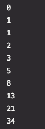

# JavaScript Challenges: Beginner to Master

54 JavaScript Challenges for Beginners To Become A Master


<hr>

# Introduction & Tutorial

If you are new to the challenge or don’t know how to start, [this](https://arnoldcode.com/wp-content/uploads/2021/04/Challenge-Template.zip) is a template you can download and take part in my coding challenge JavaScript – Internship to CEO.

<hr>

# Template
(Download the Challenge-Template)(https://arnoldcode.com/wp-content/uploads/2021/04/Challenge-Template.zip)

Just download the template, write your code into the challengeHere.js open the index.html in chrome or any other browser.

# Open Console to Inspect Your Code Output

- Chrome: Hit F12-Key to open console.
- Safari: Option + ⌘ + C.
- Firefox: Hit CTRL + SHIFT + K to open the Web console (COMMAND + SHIFT + K on Macs).
- Internet Explorer: Hit F12-Key to open console.

# Help & Detailed Solutions
Each commit has the solution inside.

To get help [contact me](mailto:info@arnoldcode.com) via e-mail.

<hr>


# Gain Time and Money Advantages
## And Learn Web Development

[Build A Game UI and an Online Resume with HTML & CSS](https://www.udemy.com/course/build-a-game-ui-and-an-online-resume-with-html-css/)

Beginners Welcome
Where and How to Start
Perfect Resources
Save A Lot of Time
Create Your First Websites
Explained in Detail, But Simple

<hr>

# Stay Up To Date
## Latest Changes and News in Web Development

[Check out My Online Articles About the Latest News and Changes in Web Development](https://medium.com/@arnoldcode)

[](https://medium.com/@arnoldcode)

# Overview Of Challenges

1. [Print numbers from 1 to 10 with a for-loop.](#challenge01)
2. [Print the odd numbers below than 99 with a for-loop.](#challenge02)
3. [Print a multiplication table with 6 with for-loop.](#challenge03)
4. [Print all the multiplication tables with numbers from 1 to 10 with a for-loop.](#challenge04)
5. [Calculate the sum of numbers from 1 to 24 with a for-loop.](#challenge05)
6. [Calculate 9! a for-loop.](#challenge06)
7. [Calculate the sum of odd numbers greater than 9 and less than 30 a for-loop](#challenge07)
8. [Create a function that will convert from Celsius to Fahrenheit. Convert 0 degree Celsius](#challenge08)
9. [Create a function that will convert from Fahrenheit to Celsius. Convert -38 degree Fahrenheit](#challenge09)
10. [Calculate the sum of numbers in an array of numbers](#challenge10)
11. [Calculate the average of the numbers in an array of numbers](#challenge11)
12. [Create a function that receives an array of numbers and returns an array containing only the positive numbers](#challenge12)
13. [Find the maximum number in an array of numbers.](#challenge13)
14. [Print the first 10 Fibonacci numbers without recursion](#challenge14)
15. [Create a function that will find the nth Fibonacci number using recursion](#challenge15)
16. [Create a function that will return a Boolean specifying if a number is prime](#challenge16)
17. [Calculate the sum of digits of a positive integer number](#challenge17)
18. [Print the first 99 prime numbers.](#challenge18)
19. [Create a function that will return in an array the first “nPrimes” prime numbers greater than a particular number “startAt”](#challenge19)
20. [Rotate an array to the left 1 position.](#challenge20)
21. [Rotate an array to the right 1 position](#challenge21)
22. [Reverse a string. The string „JavaScript with ArnoldCode is the best!"](#challenge22--pro-solution-)
23. [Create a function that will merge two arrays and return the result as a new array.](#challenge23--pro-solution-)
24. [Create a function that will receive two arrays of numbers as arguments and return an array composed of all the numbers that are either in the first array or second array but not in both](#challenge24--pro-solution-)
25. [Create a function that will receive two arrays and will return an array with elements that are in the first array but not in the second](#challenge25--pro-solution-)
26. [Create a function that will receive an array of numbers as argument and will return a new array with distinct elements](#challenge26--pro-solution-) 
27. [Calculate the sum of first 99 prime numbers](#challenge27--pro-solution-)
28. [Print the distance between the first 99 prime numbers](#challenge28) 
29. [Create a function that will return the number of words in a text](#challenge29--pro-solution-)
30. [Create a function that will capitalize the first letter of each word in a text](#challenge30--pro-solution-)
31. [Calculate the sum of numbers received in a comma delimited string.](#challenge31--pro-solution-) 
32. [Create a function that will return an array with every word of a text.](#challenge32--pro-solution-)
33. [Create a function to convert a CSV text to a “bi-dimensional” array.](#challenge33--pro-solution-)
34. [Create a function that will convert a string in an array containing the ASCII codes of each character.](#challenge34--pro-solution-)  
35. [Create a function that will convert an array containing ASCII codes in a string.](#challenge35--pro-solution-)
36. [Implement the Caesar cypher.](#challenge36--pro-solution-)
37. [Implement the bubble sort algorithm for an array of numbers.](#challenge37--pro-solution-)
38. [Create a function to calculate the distance between two points defined by their x, y coordinates.](#challenge38--pro-solution-)
39. [Create a function that will return a Boolean value indicating if two circles defined by center coordinates and radius are intersecting.](#challenge39--pro-solution-)
40. [Create a function that will receive a bi-dimensional array as argument and a number and will extract as a unidimensional array the column specified by the number.](#challenge40--pro-solution-) 
41. [Create a function to calculate the sum of all the numbers in a jagged array](#challenge41--pro-solution-)
42. [Find the maximum number in a jagged array of numbers or array of numbers](#challenge42--pro-solution-)
43. [Deep copy a jagged array with numbers or other arrays in a new array](#challenge43--pro-solution-)
44. [Create a function to return the longest word(s) in a string](#challenge44--pro-solution-)
45. [Shuffle an array of strings](#challenge45--pro-solution-)
46. [Create a function that will receive n as argument and return an array of n unique random numbers from 1 to n.](#challenge46--pro-solution-)
47. [Find the frequency of characters inside a string. Return the result as an array of objects](#challenge47--pro-solution-)
48. [Calculate Fibonacci(500) with high precision (all decimals).](#challenge48--pro-solution-)
49. [24.05.23 - Calculate 70! with high precision (all digits)](#challenge49--pro-solution-)
50. [31.05.23 - Secret](#challenge50--pro-solution-)
51. [07.06.23 - Secret](#challenge51--pro-solution-)
52. [14.06.23 - Secret](#challenge52--pro-solution-)
53. [21.06.23 - Secret](#challenge53--pro-solution-)
54. [28.06.23 - Surprise](#challenge54--pro-solution-)

# Challenge01 
## Print numbers from 1 to 10 with a for-loop.

<details>
    <summary>Spoiler "Solution-Explanation For Challenge 01"</summary>
  
  ```javascript
  // Solution #01
for (let i = 1; i <= 10; i++) {
    console.log(i);
}
```

// Get into the Community https://www.facebook.com/groups/webdevconquerors me on Facebook and don’t miss the latest Challenge!

/* EXPLANATION

  You need to print out ten numbers to the console prompt.

  A `for-loop` is the perfect tool for this job!

  You create a loop with a running index of `i` with the starting value of `1`.

  The loop will stop once `i` reaches the value of `11`, so when `i` equals `10`, the loop will execute the last time because you created the condition of    `i <= 10`.

  The running index will be increased by `1` every iteration. `i++` is the corresponding statement for that. It is the short form for `i = i+1`.

  Inside the loop you got your statement of `console.log(i);` which prints out, whatever is inside the brace, to the console window.

 */

// Get into the Community https://www.facebook.com/groups/webdevconquerors me on Facebook and don’t miss the latest Challenge!

</details>

# Challenge02 
## Print the odd numbers below than 99 with a for-loop.

<details>
  <summary>Spoiler "Solution-Explanation For Challenge 02"</summary>
  
  
```javascript
  // Solution #01
for (let i = 1; i <= 99; i += 2) {
    console.log(i);
}
```
Get into the Community https://www.facebook.com/groups/webdevconquerors me on Facebook and don’t miss the latest Challenge!

### EXPLANATION - Way #1

    To get the expected result, you start the running index i with the value of 1 and have in mind that in between every odd number comes an even number.

    Therefore, you increase your running index i by 2 every iteration with i += 2.

    You set the condition to <=99 because you only want to print out odd numbers below 99, that means the odd numbers between 1 to 97.

    Inside the loop you got your statement of console.log(i); which prints out, whatever is inside the brace, to the console window.

    In your case the wanted odd number.


// Solution #02

```javascript
for (let i = 1; i <= 99; i += 2) {
    console.log(i);
}
```
                       
Get into the Community https://www.facebook.com/groups/webdevconquerors me on Facebook and don’t miss the latest Challenge!

### EXPLANATION - Way #2

    When starting from 97, which is an odd number respectively, and iterate backwards, you almost got it.

    To get every odd number, remember yourself that in between every odd number comes an even number.

    Jumping over them by decreasing the running index `i` to get every odd number.

    You have to change the conditions for the `for-loop`.

    First `i` starts at `97`, then your condition has to be `i > 0`. Not `i >= 0`, otherwise you would print out the even number `0` (Yes `0` is an even number).

    The running index gets decreased by `2` after every iteration with `i -= 2`.

    Inside the loop you got your statement of `console.log(i);` which prints out, whatever is inside the brace, to the console window.

    In your case the wanted odd number.
</details>

# Challenge03
## Print a multiplication table with 6 with for-loop.

<details>
    <summary>Spoiler "Solution-Explanation For Challenge 03"</summary>
  
  ```javascript
for(let i = 1; i <= 10; i++)
{
    let row = "6 * " + i + " = " + 6 * i;
    console.log(row);
}
```

The console output of the solution
                      
Explanation
The row of six goes from 6 to 60. Therefore you will need a for-loop that iterates 10 times. You are a bit familiar with loops now (since you made challenge #01 and #02) and you know the rules of a for-loop.

The variable row is your printed statement every iteration. To get the multiplication table of six, you just multiply the base number of 6 with the next value of the iteration process. The row of six starts with 6*1, then 6*2, and then 6*3, and so on…

To print a decent table, you have to display the entire entry as a term. So 6 * 1 = 6 as code is "6 * " + i + " = " 6 * i . You need to have the quotation marks here, because you want a string as result. If you don’t use the quotation marks the “compiler” would then complain about the equal sign. Leaving out also the equal sign and the + sign in front of it would result in the following line:

let row = 6 *  + i + 6 * i;
Running the program then will print this:

Result of misused syntax

You would then have created a completely different term and therefore also a completely different output.

Be sure, that you know what you want to accomplish in order to use the right data types and statements.

</details>

# Challenge04
## Print all the multiplication tables with numbers from 1 to 10 with a for-loop.

<details>
    <summary>Spoiler "Solution-Explanation For Challenge 04"</summary>

  ```javascript
for(let i = 1; i <= 10; i++)
{
    printTable(i);
    console.log("");
}

function printTable(n)
{
    for(let i = 1; i <= 10; i++)
    {
        let row = n + " * " + i + " = " + n * i;
        console.log(row);
    }
}
```
A function is the best choice to accomplish this task.

If you aren’t familiar with functions. <b>No reason to worry.</b>

But first, if you accomplished this task with 10 different for loops - Your solution isn’t wrong.

It can be optimized to enter the next level of your skills: <b>10 for-loops aren’t a good thing.</b> 

Besides avoiding for loops for this solution [here are 10 principles that will level up your expertise](https://medium.com/next-level-source-code/do-you-follow-these-10-principles-for-good-programmers-1445727af447).

###Coming back to our solution - Code repetition is bad practice. 

<b>A rule of thumb:</b> If two parts of source code look the same in 50% of their lines, you've got doubled code.

Avoiding code repetition means having reusable tools.

A function suits that perfectly. A function provides input parameters. 
These are the settings for the function to operate with. 

Inside the body of the function, you have the reusable code pieces that operate slightly differently, 
depending on what you’ve put into the function as a parameter.

###Now really back to the solution: 
Having a `for`-loop to with a function call to `printTable()` inside will execute the function 
10 times since we configured the head of the `for`-loop to do it 10 times.

The function `printTable()` has an input parameter of `n`. The for-loop passes the variable `i` every iteration, 
respectively, the values of `1` to `10`.

You can now assume what the function must do. Right, the body is almost identical to the previous challenge, 
where you just print out one multiplication table. You changed the hard-coded `6` to an `n` and 
linked this variable to the input parameter of the function. That results in a function that 
prints out the multiplication table of the number we pass as a parameter.

Because the function does it for any number and once per call, we can just call it 
ten times with corresponding parameters and we got our solution right away!


The line of `console.log(""")`; just prints out an empty line as a divider for the multiplication tables.
</details>

# Challenge05
## Calculate the sum of numbers from 1 to 24 with a for-loop.

<details>
    <summary>Spoiler "Solution-Explanation For Challenge 05"</summary>

  ```javascript
let sum = 0;


for(let i = 1; i <= 24; i++)
{
    sum += i;
}

console.log(sum);
```
For the diversity, another challenge, but a simpler one! 

But that doesn’t mean you can switch off your brain 😉

You simply can’t put the accumulated value of sum inside the loop and print it to the console.

It would then end up with 24 print-out- statements.

You have to declare and initialize the variable of `sum` (and please use `let` here! Why?! [In-Depth Explanation - You will remember until your retirement why & where to use VAR, LET and CONST](https://javascript.plainenglish.io/javascript-const-vs-var-vs-let-a-comprehensive-guide-for-all-time-d6d836c8bbd7))
outside of the loop in order to print it out afterward.

If you decide to declare `sum` inside the loop, it would be initialized every iteration. But it must hold the actual accumulated value.

Furthermore, if you declared it inside the loop it would be out of our reach when we want to access it outside the loop. This is called a scope, declaring a variable inside a class/function/loop, makes it to a local variable which can’t be accessed from the outside (The article below addresses this in detail).

And this is the console output: 

</details>

# Challenge06
## Calculate 9! a for-loop.

<details>
    <summary>Spoiler "Solution-Explanation For Challenge 06"</summary>

```javascript
let factorial = 1;

for(let i = 1; i <= 9; i++)
{
    factorial *= i;
}

console.log(factorial);
```
To create the factorial of 9 you do almost the same steps as in challenge #05.

The difference lies in the loop body.

Last time you used this statement (`sum = sum+=i`) to gather the accumulated sum.

Knowing a bit about mathematics means you are aware of the fact that a factorial 
is nothing more than a chained multiplication.

So 9! is nothing more than `9 * 8 * 7 * 6 * 5 * 4 * 3 * 2 * 1 = 9!`. 

Together with the knowledge about `for`-loops you can draw your advantage out of this by using the running index
of `i` to create the factorial.

To get your desired result, you iterate exact 9 times!


</details>

# Challenge07
## Calculate the sum of odd numbers greater than 9 and less than 30 a for-loop.

<details>
    <summary>Spoiler "Solution-Explanation For Challenge 07"</summary>

```javascript
let sum = 0;

for(let i = 11; i <= 30; i += 2)
{
    sum += i;
}

console.log(sum);
```
To accomplish your task, you should remember [Challenge #02](#challenge02). 
Because back then, the task was to print out every odd number below 99. 
That means you created a `for` loop with an increment of `2`. 
After each iteration to get only odd numbers when starting with an odd number. 
In your case with `11`.

Remembering [Challenge #05](#challenge05)? This one makes you also happy again. 
There you had the task to create the `sum` of the numbers from `1` to `24`.
The same concept applies to this task. 
You add up every odd number (`n`) `n > 9` and `n < 30` to a `sum`.

After the loop has finished, you print it to the console:


Accumulated value printed out to the console (Sum of all odd numbers >9 & <30)

</details>

# Challenge08
## Create a function that will convert from Celsius to Fahrenheit. Convert 0 degree Celsius.

<details>
    <summary>Spoiler "Solution-Explanation For Challenge 08"</summary>

```javascript
function convertCelsiusToFahrenheit(number)
{
    return number * 1.8 + 32;
}

let degreeFahrenheit = convertCelsiusToFahrenheit(0);
console.log(degreeFahrenheit);
```
### How to convert Celsius to Fahrenheit

The temperature T in degrees Fahrenheit (°F) is equal to the temperature T in degrees Celsius (°C) times 9/5 plus 32:


or with decimals


### Example Conversion of 20 degrees Celsius to ?? degrees Fahrenheit:


### Accomplishing The Task

To accomplish your task, you need to return a number calculated with `1.8` and add `32`.

This is done with the parameter inside `convertCelsiusToFahrenheit()`.

The last step is to return the converted number and printing it out.

The console will print out `32` when you put in the number `0`.


</details>

# Challenge09
## Create a function that will convert from Fahrenheit to Celsius. Convert -38 degree Fahrenheit.

<details>
    <summary>Spoiler "Solution-Explanation For Challenge 09"</summary>

```javascript
function convertCelsiusToFahrenheit(number)
{
    return number * 1.8 + 32;
}

let degreeFahrenheit = convertCelsiusToFahrenheit(0);
console.log(degreeFahrenheit);
```
### How to convert Celsius to Fahrenheit

The temperature T in degrees Fahrenheit (°F) is equal to the temperature T in degrees Celsius (°C) times 9/5 plus 32:


or 


### Example Conversion of 20 degrees Celsius to ?? degrees Fahrenheit:


### Accomplishing The Task

To accomplish your task, you need to reverse the conversion of degrees to Fahrenheit. 
This means we first subtract 32 and then divide by 1.8.

This is done in the `convertFahrenheitToCelsius`-function.

Just call the function, pass the number as argument and print the returned value out. <b>And you are done!</b>

The console prints out `-38.888888888888886` when we put in the number -38.

Because this is the point where Celsius and Fahrenheit have the same amount.

</details>

# Challenge10
## Calculate the sum of numbers in an array of numbers. The array: [1, 9, -19, 3, 5, 3, 7, 14, 91].

<details>
    <summary>Spoiler "Solution-Explanation For Challenge 10"</summary>

```javascript
function summarizeArray(array) {
    let sum = 0;

    for (let i = 0; i < array.length; i++) {
        sum += array[i];
    }

    return sum;
}

let array = [1, 9, -19, 3, 5, 3, 7, 14, 91]
let sum = summarizeArray(array);
console.log(sum);
```

To accomplish our task, you need to iterate over the array and build the sum out of each element.

Since you aren’t so experienced right now, you should not use the `reduce()` method. 
Instead, write basic operations like above using a `for` loop.

After the loop has finished, you print the sum to the console:\


</details>

# Challenge11
## Calculate the average of the numbers in an array of numbers. The array: [2, 5, 17, 81, 9].

<details>
    <summary>Spoiler "Solution-Explanation For Challenge 11"</summary>

```javascript
function averageArray(array) {
    let length = array.length;
    let sum = 0;

    for (let i = 0; i < length; i++) {
        sum += array[i];
    }

    return sum / length;
}

let array = [2, 5, 17, 81, 9];
let average = averageArray(array);

console.log("Average: ", average);
```

**How to calculate an average**\
A calculated “central” value of a set of numbers.

To calculate it: add up all the numbers, then divide by the total amount of numbers.

Example: what is the average of 2, 7 and 9?\
Add all numbers: 2 + 7 + 9 = 18
Divide by numbers count (2, 7, 9 are 3 numbers) \
18 ÷ 3 = 6 

So the average is 6. (Also called the Arithmetic Mean.)

**Accomplishing your Goal**

To accomplish your task, you create a function called `averageArray()'\
that accepts a parameter. This will be your array you hand to the function.

You need to get the length of the array for a `for`-loop.\
Creating a sum and then dividing by the length gets the average.

Just return the number and print it to the console, and you are done!


</details>

# Challenge12
## Create a function that receives an array of numbers and returns an array containing only the positive numbers. The array: [-65, 11, -5, 1, -19, 45, 19, 0, 1].

<details>
    <summary>Spoiler "Solution-Explanation For Challenge 12"</summary>

```javascript
function getPositives(array) {
    let tempArray = [];

    for (let i = 0; i < array.length; i++) {
        let element = array[i];

        if (element >= 0) {
            tempArray.push(element);
        }
    }

    return tempArray;
}

let array = [-65, 11, -5, 1, -19, 45, 19, 0, 1];
let positives = getPositives(array);

console.log(positives);
```

To accomplish your task, you need to create a function called that only returns positive numbers.\
In this case I called it `getPositives()` and passed in the array.

Inside the body, you need to create a new array (`tempArray`).\
This one will keep only the positives numbers.

The next step is to loop over the array you passed to the function `array`.
Check for each element if it is positive by checking it against greater than equal 0 ( `>=0`).

If `TRUE`, add it to the newly created `tempArray`.
If `FALSE`, don't add it to `tempArray`. 

Once, you are done iterating, checking and adding, just return the `tempArray` and print it to the console.\
Done!


</details>

# Challenge13
## Create a function that receives an array of numbers and returns an array containing only the positive numbers. The array: [-65, 11, -5, 1, -19, 45, 19, 0, 1].

<details>
    <summary>Spoiler "Solution-Explanation For Challenge 13"</summary>

```javascript
function findMax(array) {
    let max = array[0];

    for (let i = 0; i < array.length; i++) {
        if (array[i] > max) {
            max = array[i];
        }
    }

    return max;
}

let array = [-21, 113, -34, 1, -9, 5, 99, 1, 0];
let max = findMax(array);
console.log("Max: ", max);
```

To accomplish your task, you create a function called `findMax()` and pass in your array.

Inside the body, you need to create a variable referencing your found maximum value.

You set the variable `max` to the first element of you array. 

Since this it the first maximum existing. You didn’t check any other so far.

The next step is to loop over the array and check if the element you are currently looking at is greater than your current `max` value.

If so, replace it to the newly found maximum element of array.

Once, you are done iterating, comparing, and adding, just return the found maximum and print it to the consol.

You are done!


</details>

# Challenge14
## Print the first 10 Fibonacci numbers without recursion. Fibonacci series: 0, 1, 1, 2, 3, 5, 8, 13, 21, 34, …

<details>
    <summary>Spoiler "Solution-Explanation For Challenge 14"</summary>

```javascript
let fibbonacci0 = 0;
console.log(fibbonacci0);

let fibonacci1 = 1;
console.log(fibonacci1);

for(let i = 2; i < 10; i++)
{
    let fibonacci = fibonacci1 + fibbonacci0;
    console.log(fibonacci);

    fibbonacci0 = fibonacci1;
    fibonacci1 = fibonacci;
}
```

You start with the creation of the `for` loop. 

Make sure to define the loop runs from `2` to `10`  in order to get the first 10 numbers. 

Start with the `0` followed by `1` and you only need 8 more numbers to complete.

Any number `n` of the Fibonacci series is created by adding up the number `n-1` with the number `n-2`.

To get the third number, we need to have number `n-1` and `n-2`. 

Reaching `n = 3`, means the number will be `2` and `1` of the series.

The equation is therefore: `n = n – 1 + n – 2;`

Which results into: `2 = 1 + 0;`. The 3rd number of the Fibonacci series.

Then you need to switch the `n – 1` and `n – 2` to the newly created ones to go further in our Fibonacci series. 

E voilá, do it as long as you want to get all numbers for the Fibonacci series.

The complete outcome of the console:



</details>

# Challenge15
## Create a function that will find the nth Fibonacci number using recursion. Fibonacci series: 0, 1, 1, 2, 3, 5, 8, 13, 21, 34, … . Use nth = 14

<details>
    <summary>Spoiler "Solution-Explanation For Challenge 15"</summary>

```javascript
function findFibonacci(number)
{
    if (number === 0)
        return 0;

    if (number === 1)
        return 1;

    return findFibonacci(number - 1) + findFibonacci(number - 2);
}

let fibonacciSeries = findFibonacci(14);

console.log(fibonacciSeries);
```

The Fibonacci numbers are the numbers in the following integer sequence.

`0, 1, 1, 2, 3, 5, 8, 13, 21, 34, 55, 89, 144, ……`

In mathematical terms, the sequence Fn of Fibonacci numbers is defined by the recurrence relation:


</details>

# Challenge16
## Create a function that will return a Boolean specifying if a number is prime. Test with 1,5,6,7,9,11,13 & 27.

<details>
    <summary>Spoiler "Solution-Explanation For Challenge 16"</summary>

```javascript
function isPrime(number)
{
    if (number < 2)
        return false;

    if (number == 2)
        return true;

    let maxDiv = Math.sqrt(number);

    for(let i = 2; i <= maxDiv; i++)
    {
        if (number % i == 0)
        {
            return false;
        }
    }

    return true;
}
```
## What is a prime number in maths?

Prime numbers are special numbers, greater than 1, that have exactly two factors, themselves and 1. 

19 is a prime number. It can only be divided by 1 and 19. 

9 is not a prime number.

## Solution

In your solution, you first check if the passed number is below 2. 

Then you already checked against any number below 2 being no prime number.

If the number is equal to 2, then it is a prime number and you can return `true` already.

If any number passed both checks and you are still inside your function, then you'll need find the maximum divisor by getting the square root of our passed number.

With a for loop, you check if the number is remainderless dividable by the iterator of i. 

If the remainder is 0, then you definitely have another valid calculation instead of only being able to divide a number with 1 and itself to be a prime number. 

Therefore, you are returning `false`.

Testifying the given numbers results into this printout.


</details>

# Challenge17
## Calculate the sum of digits of a positive integer number. The integer 1235321.

<details>
    <summary>Spoiler "Solution-Explanation For Challenge 17"</summary>

```javascript
function sumDigits(number)
{
    let string = number.toString();
    let sum = 0;

    for(let char of string)
    {
        let digit = parseInt(char);
        sum += digit;
    }

    return sum;
}

let sum = sumDigits(1235321);

console.log("Sum: ", sum);
```

The solution is pretty straightforward. 

You need to separate the digits to loop over them and add them to a sum.

You can do it by a conversion to a string because this is nothing more than a char array under the hood.

You can take advantage of this knowledge by iterating over the array with a for-of-loop.

While looping you add up the sum and finally returning the sum to the caller.

This is the printout after the sum was created:


</details>

# Challenge18
## Print the first 99 prime numbers.

<details>
    <summary>Spoiler "Solution-Explanation For Challenge 18"</summary>

```javascript
printPrimes(99);

// Function prints the first nPrimes numbers
function printPrimes(nPrimes)
{
    let n = 0;
    let i = 2;

    while(n < nPrimes)
    {
        if (isPrime(i))
        {
            console.log(n, " --> ", i);
            n++;
        }

        i++;
    }
}


// Returns true if a number is prime
function isPrime(number)
{
    if (number < 2)
        return false;

    if (number == 2)
        return true;

    let maxDiv = Math.sqrt(number);

    for(let i = 2; i <= maxDiv; i++)
    {
        if (number % i == 0)
        {
            return false;
        }
    }

    return true;
}
```

The function `printPrimes(nPrimes)` is your looping function that will print out the number of primes you pass in.

We stick to `99` for this challenge.

The next step is to set `n` to `0`, because you want to start with the 0th prime number and set `i` to `2`,
because we know the first prime number must be `2`.

Then you loop over the condition of `n < nPrimes` and check if the value of `i` is a prime number by actually calling your second function: `isPrime(number)`.

This function is all about checking if the number is below `2`; no prime number. Then if it is equal to `2`; a prime number. 

For every other case, you apply the commonly known rules for prime numbers. Being divideable only by itself or `1`.

The for loop checks if you have a `maxdivisor` that results in a valid integer division with the result of `0`.

If so, it isn’t a prime number; referring back to the commonly known rules for prime numbers.

If the loop does not return `false` and run through successfully, the function returns `true`, and the while loop of `printPrimes` continues.

Below is the printout for the first `18` numbers. 

The list goes on until `99`. The output means the 0th prime number is `2`, then the 1st prime number is `3`, and so on…

)
</details>

# Challenge19
## Create a function that will return in an array the first “nPrimes” prime numbers greater than a particular number “startAt”.

<details>
    <summary>Spoiler "Solution-Explanation For Challenge 19"</summary>

```javascript
console.log(getPrimes(10, 100));


function getPrimes(nPrimes, startAt)
{
    let array = [];

    let i = startAt;

    while(array.length < nPrimes)
    {
        if (isPrime(i))
        {
            array.push(i);
        }

        i++;
    }

    return array;
}

// Returns true if a number is prime
function isPrime(number)
{
    if (number < 2)
        return false;

    if (number == 2)
        return true;

    let maxDiv = Math.sqrt(number);

    for(let i = 2; i <= maxDiv; i++)
    {
        if (number % i == 0)
        {
            return false;
        }
    }

    return true;
}
```

The function `getPrimes` has to accept two parameters. 
1. `nPrimes` which decides the number of prime numbers you want to be printed
2. `startAt` which decides where you start to calculate the prime numbers

You create an empty array and set your runningIndex `i` equal to the `startAt` variable.

A while loop makes a continuous call to the `isPrime` function and passes in the number you want to check. 

This is being done as long as your array is below the `nPrimes` variable.

Once you have the predestined number of primes, you will skip the while loop and return the array with prime numbers.

I have already explained the `isPrime` function in [Challenge #18](#challenge18).

If you call this function with `console.log(getPrimes(10, 100));` then the following will be the output.


</details>

# Challenge20
## Rotate an array to the left 1 position. E.g. [1, 2, 3, 4, 5] -> [ 2, 3, 4, 5, 1 ] | [1, 2, 4, 5] -> [ 2, 4, 5, 1 ].

<details>
    <summary>Spoiler "Solution-Explanation For Challenge 20"</summary>

```javascript
let array = [1, 2, 3, 4, 5];
rotateLeft(array);
console.log(array);

function rotateLeft(array)
{
    let first = array.shift();
    array.push(first);
}
```

You can achieve this challenge’s goal quite easily by using the `shift()` and the `push()` method for arrays. 

The `shift()` method removes the first element of an array and returns it. 

If you store it now into a temporarily variable (in this case `first`) then you can use the `push()` method to push it as the last element of an array.

If you want to dig deeper into `shift()` and `push()` and JavaScript + Web Development take my [JavaScript Course](https://arnoldcodeacademy.teachable.com/p/javascript-beginner-course), 
where I introduce you also to all kinds of array methods (there are plenty of them and they are very useful to achieve massive results in a short amount of code and time).

<b>[A discount awaits you! Just subscribe to my newsletter.](https://arnoldcodeacademy.ck.page/26webdevcheatsheets)

The output for the code above is:


</details>


# Challenge21
## Rotate an array to the right 1 position. E.g. [1, 2, 3] -> [ 3, 1, 2 ] | [1, 2, 4, 6, 3] -> [ 3, 1, 2, 4, 6 ].

<details>
    <summary>Spoiler "Solution-Explanation For Challenge 21"</summary>

```javascript
let array = [1, 2, 3];

rotateRight(array);

console.log(array);

function rotateRight(array)
{
    let last = array.pop();
    array.unshift(last);
}
```

You can achieve the challenge’s goal quite easily by using the opposites of `shift()` and the `push()` method for arrays.

This time you have to use the `pop()` method which removes the last element of an array and returns it.

If you store it now into a variable (in this case `last`) then you can use the `unshift()` method to push it as the 
first element of an array.


If you want to dig deeper into `shift()` and `push()` and JavaScript + Web Development take my [JavaScript Course](https://arnoldcodeacademy.teachable.com/p/javascript-beginner-course),
where I introduce you also to all kinds of array methods (there are plenty of them and they are very useful to achieve massive results in a short amount of code and time).

<b>[A discount awaits you! Just subscribe to my newsletter.](https://arnoldcodeacademy.ck.page/26webdevcheatsheets)

The output for the code above is:


</details>


# Challenge22 + Pro Solution 😉
## Reverse a string. The string „JavaScript with ArnoldCode is the best!“

<details>
    <summary>Spoiler "Solution-Explanation For Challenge 22"</summary>

```javascript
// Solution with for - loops
let reversedString = reverseString('JavaScript with ArnoldCode is the best!');
console.log(reversedString);

function reverseString(string)
{
    let string2 = "";

    for(let i = string.length - 1; i >= 0; i--)
    {
        string2 += string[i];
    }

    return string2;
}
````
## Solution for pro developers!
```typescript
reversedString = reverseString('JavaScript with ArnoldCode is the best!');
console.log(reversedString);

function reverseString(string)
{
    return string.split('').reverse().join('')
}
```

## Explanation For-Loops

The function `reverseString` creates an empty string `string2` where the reversed string will be stored to.

A simple `for` loop covers the tasks of reversing your string.

It does it by decrementing the running index of `i` from the `string.length` towards `0` and pushes beginning from the last element of the passed `string` until the first into `string2`.

*This is possible due to the fact that a string is in fact an arrays of characters.*

After the for loop, the function just returns your newly reversed `string` of `string2`.


If you want to dig deeper into strings, arrays and  their methods check out the pro solution.

## Explanation Pro Solution

You can achieve the challenge’s goal quite easily by using 3 advanced methods for strings and arrays:
- [split](https://developer.mozilla.org/en-US/docs/Web/JavaScript/Reference/Global_Objects/String/split) - Splits up a string by a given character template (in this case `''`; any char)
- [reverse](https://developer.mozilla.org/en-US/docs/Web/JavaScript/Reference/Global_Objects/Array/reverse) - Reverses an order of elements inside an array
- [join](https://developer.mozilla.org/en-US/docs/Web/JavaScript/Reference/Global_Objects/Array/join) - Combines all elements into a single string

So the order of actions for success is:
1. Splitting the string into characters
2. Reversing the order of characters
3. Combining all reversed characters into a single string

If you want to become a [Web Developer you want to take my examples](https://arnoldcodeacademy.teachable.com/p/javascript-beginner-course), explanations and story telling by breaking the 4th dimensions and save you a lot of time & effort 😉

[A discount and 26 Cheatsheets await you! Just subscribe to my newsletter.](https://arnoldcodeacademy.ck.page/26webdevcheatsheets)

[](https://www.udemy.com/user/arnold-abraham-3/)

</details>

# Challenge23 + Pro Solution 😉
## Create a function that will merge two arrays and return the result as a new array. The two arrays: [9, 8, 7, 6],  [1, 2, 3, 4].

<details>
    <summary>Spoiler "Solution-Explanation For Challenge 23"</summary>

```javascript
// Solution with for - loops
let array1 = [9, 8, 7, 6];
let array2 = [1, 2, 3, 4];

let mergedArrays = mergeArrays(array1, array2);
console.log(mergedArrays);

function mergeArrays(array1, array2)
{
    let tempArray = [];

    for(let element of array1)
    {
        tempArray.push(element);
    }

    for(let element of array2)
    {
        tempArray.push(element);
    }

    return tempArray;
}
````
## Solution for pro developers!
```typescript
let mergedArraysPro = mergeArrays(array1, array2);
console.log(mergedArraysPro);

function mergeArrays(array1, array2)
{
    return array1.concat(array2)
}
```

## Explanation For-Loop Solution

The function `mergeArrays` has two inputs (`array1` and `array2`). 

It also does create an empty array `tempArray` where the combined and merged array will be stored to.

This time you need two `for` loops to cover the merging process. 

You simply push all elements of the first array to the variable `tempArray`.

When this is done, you approach the second array and push also each element into `tempArray`.

Once you’ve iterated over both arrays and all elements are stored into `tempArray` you just do the return and already have it.
A merged array.


*This isn’t the best method you can use but a suitable one, if you are just starting out.* 

It is a good way to practice loops, but in terms of functionality, clean code, and extensibility you should take my JavaScript Course, where I introduce you also to all kinds of array methods to write maintainable and scalable code – a must-have for every JavaScript Developer.

If you want to dig deeper into strings, arrays and  their methods check out the pro solution.

## Explanation Pro Solution

You can achieve the challenge’s goal quite easily by using 1 advanced method for arrays:
- [concat](https://developer.mozilla.org/en-US/docs/Web/JavaScript/Reference/Global_Objects/Array/concat) - The concat() method is used to merge two or more arrays. This method does not change the existing arrays, but instead returns a new array.

If you want to become a [Web Developer you want to take my examples](https://arnoldcodeacademy.teachable.com/p/javascript-beginner-course), explanations and story telling by breaking the 4th dimensions and save you a lot of time & effort 😉

[A discount and 26 Cheatsheets await you! Just subscribe to my newsletter.](https://arnoldcodeacademy.ck.page/26webdevcheatsheets)

[](https://www.udemy.com/user/arnold-abraham-3/)

</details>

# Challenge24 + Pro Solution 😉
## Create a function that will receive two arrays of numbers as arguments and return an array composed of all the numbers that are either in the first array or second array but not in both. The two arrays: [1, 9, 17, 15, 3, 9, 15] , [1, 9, 3, 2, 17]


<details>
    <summary>Spoiler "Solution-Explanation For Challenge 24"</summary>

```javascript
// Solution with for - loops
let array1 = [1, 9, 17, 15, 3, 9, 15];
let array2 = [1, 9, 3, 2, 17];

let exclusivelyMergedArray = mergeExclusive(array1, array2);
console.log(exclusivelyMergedArray);

function mergeExclusive(array1, array2)
{
    let tempArray = [];

    for(let element of array1)
    {
        if (!array2.includes(element))
        {
            tempArray.push(element);
        }
    }

    for(let element of array2)
    {
        if (!array1.includes(element))
        {
            tempArray.push(element);
        }
    }

    return tempArray;
}
````
## Solution for pro developers!
```javascript
let mergedArraysPro = mergeArrays(array1, array2);
console.log(mergedArraysPro);

function mergeArrays(array1, array2)
{
    return array1.filter(element => !array2.includes(element)).concat(array2.filter(element => !array1.includes(element)))
}
```

## Explanation For-Loop Solution

The function `mergeExclusive` has two inputs (`array1` and `array2`).

It also does create an empty array `tempArray` where the result array will be stored to.

You will need two `for` loops to cover the merging process.

You simply iterate over `array1` and push only those elements of the first array to the variable `tempArray` that are also in `array2`.

Then you repeat the process with `array2` and push only those elements into the result array that are also in `array1`. 

Once you’ve iterated over both arrays and all elements are stored into `tempArray` you just do the return and already have it.

An exclusively merged array.


*This isn’t the best method you can use but a suitable one, if you are just starting out.*

It is a good way to practice loops, but in terms of functionality, clean code, and extensibility you should take my JavaScript Course, where I introduce you also to all kinds of array methods to write maintainable and scalable code – a must-have for every JavaScript Developer.

If you want to dig deeper into strings, arrays and  their methods check out the pro solution.

## Explanation Pro Solution

You can achieve the challenge’s goal quite easily by combining several advanced method for arrays:
- [filter](https://developer.mozilla.org/en-US/docs/Web/JavaScript/Reference/Global_Objects/Array/filter) - The filter() method creates a shallow copy of a portion of a given array, filtered down to just the elements from the given array that pass the test implemented by the provided function.
- [concat](https://developer.mozilla.org/en-US/docs/Web/JavaScript/Reference/Global_Objects/Array/concat) - The concat() method is used to merge two or more arrays. This method does not change the existing arrays, but instead returns a new array.

If you want to become a [Web Developer you want to take my examples](https://arnoldcodeacademy.teachable.com/p/javascript-beginner-course), explanations and story telling by breaking the 4th dimensions and save you a lot of time & effort 😉

[A discount and 26 Cheatsheets await you! Just subscribe to my newsletter.](https://arnoldcodeacademy.ck.page/26webdevcheatsheets)

[](https://www.udemy.com/user/arnold-abraham-3/)

</details>

# Challenge25 + Pro Solution 😉
## Create a function that will receive two arrays and will return an array with elements that are in the first array but not in the second. The two arrays:  [12, 21, 34, 1, 35, 7, 19] , [-1, 7, 1, 61, 69].


<details>
    <summary>Spoiler "Solution-Explanation For Challenge 25"</summary>

```javascript
// Solution with for - loops
let array1= [12, 21, 34, 1, 35, 7, 19];
let array2 = [-1, 7, 1, 61, 69];

let leftMergedArray = mergeLeft(array1, array2);
console.log(leftMergedArray);

function mergeLeft(array1, array2)
{
    let tempArray = [];

    for(let element of array1)
    {
        if (!array2.includes(element))
        {
            tempArray.push(element);
        }
    }

    return tempArray;
}
````
## Solution for pro developers!
```javascript
let leftMergedArrayPro = mergeLeftPro(array1, array2);
console.log(leftMergedArrayPro);

function mergeLeftPro(array1, array2)
{
    return array1.filter(element => !array2.includes(element))
}
```

## Explanation For-Loop Solution

This challenge feels like easy holidays, doesn#t it?

It is like the one before, but only the first half if it.

The function `mergeLeft` has two inputs (`array1` and `array2`).

It also does create an empty array `tempArray` where the result array will be stored to.

You will need one `for` loop to cover the left-merging process.

You simply iterate over `array1` and push only those elements of the first array to the variable `tempArray` that are also not in `array2`.

Once you’ve iterated over `array1` and all elements are stored into `tempArray` you just do the return and already have it.

An exclusively merged array.


*This isn’t the best method you can use but a suitable one, if you are just starting out.*

It is a good way to practice loops, but in terms of functionality, clean code, and extensibility you should take my JavaScript Course, where I introduce you also to all kinds of array methods to write maintainable and scalable code – a must-have for every JavaScript Developer.

If you want to dig deeper into strings, arrays and  their methods check out the pro solution.

## Explanation Pro Solution

You can achieve this challenge’s goal also quite easily by combining several advanced method for arrays:
- [filter](https://developer.mozilla.org/en-US/docs/Web/JavaScript/Reference/Global_Objects/Array/filter) - The filter() method creates a shallow copy of a portion of a given array, filtered down to just the elements from the given array that pass the test implemented by the provided function.
- [concat](https://developer.mozilla.org/en-US/docs/Web/JavaScript/Reference/Global_Objects/Array/concat) - The concat() method is used to merge two or more arrays. This method does not change the existing arrays, but instead returns a new array.

If you want to become a [Web Developer you want to take my examples](https://arnoldcodeacademy.teachable.com/p/javascript-beginner-course), explanations and story telling by breaking the 4th dimensions and save you a lot of time & effort 😉

[A discount and 26 Cheatsheets await you! Just subscribe to my newsletter.](https://arnoldcodeacademy.ck.page/26webdevcheatsheets)

[](https://www.udemy.com/user/arnold-abraham-3/)

</details>

# Challenge26 + Pro Solution 😉
## Create a function that will receive an array of numbers as argument and will return a new array with distinct elements. The Array: 12, 12, 3, 6, -1, 21, 9, 7, 10, 12,6 ,- 69, -1, 100.


<details>
    <summary>Spoiler "Solution-Explanation For Challenge 26"</summary>

```javascript
let distinctElements = getDistinctElements([12, 12, 3, 6, -1, 21, 9, 7, 10, 12,6 ,- 69, -1, 100]);
console.log(distinctElements);

function getDistinctElements(array)
{
    let tempArray = [];

    for(let i = 0; i < array.length; i++)
    {
        if (!isInArray(array[i], tempArray))
        {
            tempArray.push(array[i]);
        }
    }

    return tempArray;
}

function isInArray(number, array)
{
    for(let i = 0; i < array.length; i++)
    {
        if (array[i] === number)
            return true;
    }

    return false;
}
````
## Solution for pro developers!
```javascript
console.log(getDistinctElementsPro([12, 12, 3, 6, -1, 21, 9, 7, 10, 12,6 ,- 69, -1, 100]))

function getDistinctElementsPro(array){
    return array.filter((v, i, a) => a.indexOf(v) === i);
}
```

## Explanation For-Loop Solution

You will need 2 functions here, otherwise it could fastly become a mess to comprehend afterward.

The overall solution is to iterate over the array you are passing into `getDistinctElements` and iterate over it with a `for`-loop.

The next step is to check for each element if it already exist in our newly created `tempArray`.

- If not: Add it
- If yes: skip it

You do this until you have checked each element and then return the `tempArray`.

E voilá.


*This isn’t the best method you can use but a suitable one, if you are just starting out.*

It is a good way to practice loops, but in terms of functionality, clean code, and extensibility you should take my JavaScript Course, where I introduce you to all kinds of array methods to write maintainable and scalable code – a must-have for every JavaScript Developer.

If you want to dig deeper into strings, arrays and  their methods check out the pro solution.

## Explanation Pro Solution

You can achieve this challenge’s goal also quite easily by combining several advanced method for arrays:
- [filter](https://developer.mozilla.org/en-US/docs/Web/JavaScript/Reference/Global_Objects/Array/filter) - The filter() method creates a shallow copy of a portion of a given array, filtered down to just the elements from the given array that pass the test implemented by the provided function.
- [indexOf](https://developer.mozilla.org/en-US/docs/Web/JavaScript/Reference/Global_Objects/Array/indexOf) - The indexOf() method returns the first index at which a given element can be found in the array, or -1 if it is not present.

If you want to become a [Web Developer and want to profit from a huge time bonus to become a developer, take my course](https://arnoldcodeacademy.teachable.com/p/javascript-beginner-course). Explanations and story telling break the 4th dimensions to save you a lot of time & effort 😉

[A discount and 26 Cheatsheets awaits you! Just subscribe to my newsletter.](https://arnoldcodeacademy.ck.page/26webdevcheatsheets)

[](https://www.udemy.com/user/arnold-abraham-3/)

</details>

# Challenge27 + Pro Solution 😉
## Calculate the sum of first 99 prime numbers.


<details>
    <summary>Spoiler "Solution-Explanation For Challenge 27"</summary>

```javascript
console.log("Sum of first ", 99, " primes is ", sumPrimes(99));

function sumPrimes(number)
{
    let foundPrimes = 0;
    let i = 2;
    let sum = 0;

    while(foundPrimes < number)
    {
        if (isPrime(i))
        {
            foundPrimes++;
            sum += i;
        }

        i++;
    }

    return sum;
}

// Returns true if number n is prime
function isPrime(number)
{
    if (number < 2)
        return false;

    if (number == 2)
        return true;

    let maxDiv = Math.sqrt(number);

    for(let i = 2; i <= maxDiv; i++)
    {
        if (number % i === 0)
        {
            return false;
        }
    }

    return true;
}
````
## Solution for pro developers!
```javascript
console.log("Sum of first " + 99 + "primes is" + sumOfNPrimes(99) + ". Calculated with Pro-Solution.");

function sumOfNPrimes(num) {
    return getNprimes(num).reduce((a, b) => a + b)
}

function getNprimes(n) {
    const primes = [];
    let i = 2

    while (primes.length < n) {
        if (isPrime(i)) {
            primes.push(i)
        }
        i++
    }
    return primes;
}
```

## Quick Knowledge Consolidation

"A prime number is a number which has just two factors: itself and 1. Or in other words it can be divided evenly only by itself and 1. For instance, 3 is a prime number because it can be divided evenly only by itself and one. On the other hand, 6 can be divided evenly by 1, 2, 3 and 6. Hence, the number 6 is not a prime number."
by [Math Basics: Prime Numbers](https://www.qsleap.com/gmat/resources/math-basics-prime-numbers#:~:text=A%20prime%20number%20is%20a,%2C%202%2C%203%20and%206.)

### Here are some divisibility rules for prime numbers:

- If the number is even, it will always be divisible by 2
- If the sum of the digits is divisible by 3, the number will be divisible by 3
- If the number ends with 5 or 0, it will be divisible by 5
- Double the last digit and subtract it from the rest of the number. If the answer is divisible by 7, the original number will be divisible by 7
- Add alternate digits and subtract it from the difference of the next sum of alternate digits, For instance, if the number is 574652, add 5+4+5=14 and 7+6+2=15. If the difference i.e. 1 is divisible by 11, then the number will be divisible by 11. In this case, clearly the number is not divisible by 11.

## Explanation For-Loop Solution

Also here, you will need 2 functions. Otherwise it could become hard to comprehend afterward.

The first function is `sumPrimes` to actually add each n prime number n. 

The second function `isPrime` that checks if the number in the argument is actually a prime and returns `true` or `false`.

### isPrime() in Detail

Accepts an argument called `number`. This function is not fail-safe. If you pass in a string, JavaScript will automatically try
to convert it to a number. With a boolean, you screw the entire program.

Anyways, the function makes an early exit if the number is below 2 (no prime) and also if the number is 2 (prime). 

If the argument passes both tests, you need to get the maximum divisor by getting the square-root.

`let maxDiv = Math.sqrt(number);`

Last check to determine if you passed a prime number or not is to iterate (beginning with 2) until you reach the max divisor.

If now the numbers is divided by any of the divisors without a fraction, it disqualifies itself and the function returns `false`.

Otherwise you got yourself a `true` prime number.

*Remember: If any other number except itself or 1 returns a division without any fraction, it isn't classified as prime number.*

### sumPrimes() in Detail

It accepts a limit of prime numbers you want to calculate the sum of.

It will always start at 2, because the first ever possible prime is 2.

This function needs 3 local variables:

- `foundPrimes`: holds a temporarily state about how many prime numbers we already got
- `i`: the current number to investigate for prime-qualities
- `sum`: result of the calculation (will be returned in the end)

The `while`-loop iterates until the passed argument of `number` matches the `foundPrimes` variable.

First it checks if the current starting number (held in `i`) is a a prime (done by calling the `isPrime()`-function).

If a prime number has been found, it increased the `foundPrimes` counter and adds the found number to the `sum`.

When the exit condition of the while loop returns false, it returns `sum` to the caller.


*This isn’t the best method you can use but a suitable one, if you are just starting out.*

It is a good way to practice loops, but in terms of functionality, clean code, and extensibility you should take my JavaScript Course, where I introduce you to all kinds of array methods to write maintainable and scalable code – a must-have for every JavaScript Developer.

If you want to dig deeper into strings, arrays and  their methods check out the pro solution.

## Explanation Pro Solution

You can achieve this challenge’s goal also quite easily by combining several advanced method for arrays:
- [reduce](https://developer.mozilla.org/en-US/docs/Web/JavaScript/Reference/Global_Objects/Array/reduce) - The reduce() method executes a user-supplied "reducer" callback function on each element of the array, in order, passing in the return value from the calculation on the preceding element. The final result of running the reducer across all elements of the array is a single value.

If you want to become a [Web Developer and want to profit from a huge time bonus to become a developer, take my course](https://arnoldcodeacademy.teachable.com/p/javascript-beginner-course). Explanations and story telling break the 4th dimensions to save you a lot of time & effort 😉

[A discount and 26 Cheatsheets awaits you! Just subscribe to my newsletter.](https://arnoldcodeacademy.ck.page/26webdevcheatsheets)

[](https://www.udemy.com/user/arnold-abraham-3/)

</details>

# Challenge28 
##  Print the distance between the first 99 prime numbers


<details>
    <summary>Spoiler "Solution-Explanation For Challenge 28"</summary>

```javascript
printDistances(99);

// Print distances between the first n prime numbers
function printDistances(n)
{
    let lastPrime = 2;
    let i = lastPrime + 1;
    let foundPrimes = 1;

    while(foundPrimes < n)
    {
        if (isPrime(i))
        {
            console.log(i - lastPrime, "\t", i, " - ", lastPrime);

            foundPrimes++;
            lastPrime = i;
        }

        i++;
    }
}

// Returns true if number n is prime
function isPrime(n)
{
    if (n < 2)
        return false;

    if (n == 2)
        return true;

    let maxDiv = Math.sqrt(n);

    for(let i = 2; i <= maxDiv; i++)
    {
        if (n % i === 0)
        {
            return false;
        }
    }

    return true;
}

````
## Solution for pro developers!
```javascript
// TODO
```

## Quick Knowledge Consolidation

In case you don't know anything about Prime Numbers, check the [previous challenge with a detailed explanation](#challenge27--pro-solution-).

## Explanation For-Loop Solution

Also here, you will need 2 functions. Otherwise it could become hard to comprehend afterward.

The first function is `printDistances` to actually print the distances to the console.

The second function `isPrime` that checks if the number in the argument is actually a prime and returns `true` or `false`.

### isPrime() in Detail (same as in previous challenge)

Accepts an argument called `number`. This function is not fail-safe. If you pass in a string, JavaScript will automatically try
to convert it to a number. With a boolean, you screw the entire program.

Anyways, the function makes an early exit if the number is below 2 (no prime) and also if the number is 2 (prime).

If the argument passes both tests, you need to get the maximum divisor by getting the square-root.

`let maxDiv = Math.sqrt(number);`

Last check to determine if you passed a prime number or not is to iterate (beginning with 2) until you reach the max divisor.

If now the numbers is divided by any of the divisors without a fraction, it disqualifies itself and the function returns `false`.

Otherwise you got yourself a `true` prime number.

*Remember: If any other number except itself or 1 returns a division without any fraction, it isn't classified as prime number.*

### printPrimes() in Detail

This function accepts one parameter `n`. This is the upper bound where the function stops printing out distances.

It needs 3 local variables: 
- `lastPrime`: the last Prime number the function found
- `i`: the current number to investigate for prime-qualities
- `foundPrimes`: holds a temporarily state about how many Prime numbers we already got

The `while`-loop checks if `foundPrimes` is below the input parameter of `n`. The loop will continue as long as we haven't found 99 primes to fulfill this challenge.

Since the function gets the command to print the distances for 99 Prime numbers, the function needs to start at the lowest Prime (2) and check every number from there.

It does so by passing each number into the `isPrime()` function. 

If no Prime --> jump to next iteration
If Prime --> print out a statement that displays the following order `distance     current Prime "-" last Prime `. Increasing the 
counter of found Primes and setting the `lastPrime` to the currently found (`i`).

(compare solution picture)

(`\t` is an escape sequence for a tabulator-stop).


</details>

# Challenge29 + Pro Solution 😉
## Create a function that will return the number of words in a text. Use this text "Very good Sir! Just make sure you finish on the Bach, never finish on Debussy!"

<details>
    <summary>Spoiler "Solution-Explanation For Challenge 29"</summary>

```javascript
const text = "Very good Sir! Just make sure you finish on the Bach, never finish on Debussy!"

const wordsCount = countWords(text);

console.log(wordsCount);

function countWords(text) {
    let wasSeparator = true;
    let words = 0;

    for (let character of text) {
        if (isSeparator(character)) {
            wasSeparator = true;
            continue;
        }

        if (wasSeparator) {
            words++;
            wasSeparator = false;
        }
    }

    return words;
}

function isSeparator(character) {
    const separators = [" ", "\t", "\n", "\r", ",", ";", ".", "!", "?"];
    return separators.includes(character);
}
````
## Solution for pro developers!
```javascript
console.log(countWordsPro(text));

function countWordsPro(text){

    text = text.replace(/(^\s*)|(\s*$)/gi,"");
    text = text.replace(/[ ]{2,}/gi," ");

    return text.split(' ').length;
}
```

## Explanation For-Loop Solution

Again 2 functions are better:  & `.

- `countWords(text)` counts every word inside the text by iterating over each character
- `isSeparator(character)` checks for separator characters to know when when a word ends. 

The overall solution is to iterate over the text you pass into `countWords` and iterate over each character with a `for`-loop.

The next step is to check for each character if it is a separator character your `text`.

- If seperator: set boolean of `wasSeparator` to `true` and increase word count with `words++`and set it back to false for the next iteration
- If no seperator: skip rest of the loop by using `continue`

You do this until you have checked each character for the given text the `words`.

*Done!*

The `isSeparator` function has the separator characters stored in an array called `separators`. 
- [includes](https://developer.mozilla.org/en-US/docs/Web/JavaScript/Reference/Global_Objects/Array/includes) - The includes() method determines whether an array includes a certain value among its entries, returning true or false as appropriate.

Each passed character will be checked if it matches any of the given elements of `separators`.


*This isn’t the best method you can use but a suitable one, if you are just starting out.*

If you want to dig deeper into professional coding in JavaScript check out the pro solution.

## Explanation Pro Solution

The Pro Solution uses [Regular Expressions](https://levelup.gitconnected.com/indiana-jones-and-the-universal-way-to-search-for-text-1901990f53ae). 

[Read this 5 min Article from me to learn the fundamentals and some professional tips & tricks.](https://levelup.gitconnected.com/indiana-jones-and-the-universal-way-to-search-for-text-1901990f53ae)

[Regular Expressions in JavaScript With Indiana Jones - 5 minutes to get down with regular expressions](https://levelup.gitconnected.com/indiana-jones-and-the-universal-way-to-search-for-text-1901990f53ae).

[](https://levelup.gitconnected.com/indiana-jones-and-the-universal-way-to-search-for-text-1901990f53ae)


If you want to become a [Web Developer and want to profit from a huge time bonus to become a developer, take my course](https://arnoldcodeacademy.teachable.com/p/javascript-beginner-course). Explanations and story telling break the 4th dimensions to save you a lot of time & effort 😉

[A discount and 26 Cheatsheets awaits you! Just subscribe to my newsletter.](https://arnoldcodeacademy.ck.page/26webdevcheatsheets)

[](https://www.udemy.com/user/arnold-abraham-3/)

</details>

# Challenge30 + Pro Solution 😉
## Create a function that will capitalize the first letter of each word in a text. The text: „javascript and arnold code academy are the best to me!"

<details>
    <summary>Spoiler "Solution-Explanation For Challenge 30"</summary>

```javascript
console.log(capitalizeFirstLetter("javascript and arnold code academy are the best to me!"));

function capitalizeFirstLetter(text)
{
    let tempText = "";

    for(let i = 0; i < text.length; i++)
    {
        let currentCharacter = text[i];
        let previousCharacter = i > 0 ? text[i - 1] : " ";

        if (!isSeparator(currentCharacter) && isSeparator(previousCharacter))
        {
            currentCharacter = currentCharacter.toUpperCase();
        }

        tempText += currentCharacter;
    }

    return tempText;
}

function isSeparator(character)
{
    let separators = [" ", "\t", "\n", "\r", ",", ";", ".", "!", "?"];
    return separators.includes(character);
}
````
## Solution for pro developers!
```javascript
console.log(capitalizeFirstLetterPro("javascript and arnold code academy are the best to me!"))

function capitalizeFirstLetterPro(text) {
    return text.split(" ").map(x => x.charAt(0).toUpperCase() + x.slice(1)).join(" ")
}
```

## Explanation For-Loop Solution

The rule to know how many functions you should create:

`One function has one purpose. And this purpose should be small.` This is part of the [SOLID-Principles every good developer must know](https://medium.com/arnoldcode-academy/unity-solid-s-single-responsibility-6707d9569e73).

Anyways, the solution involves the following 2 functions:

- `capitalizeFirstLetter(text)` checks every character to be the first of a word and capitalize if it is
- `isSeparator(character)` checks for separator characters to know when when a word ends

The overall solution is to iterate over the text you pass into `capitalizeFirstLetter` and iterate over each character with a `for`-loop.

The next step is to check a set of two characters:
- `previousCharacter`
- `currentCharacter` 

``` javascript
let currentCharacter = text[i];

let previousCharacter = i > 0 ? text[i - 1] : " ";
```
The first line is easy, but the second one that defines `previousCharacter` is a [Ternary-Operator](https://javascript.plainenglish.io/javascript-ecmascript-history-the-hidden-features-acb38af57be8)
and does the following: 
- If the expression before the `?` (`i > 0`) evaluates to `true` take `text[i-1]`
- If the expression before the `?` (`i > 0`) evaluates to `false` take `" "`

*Why?* Because `" "' is a separator and will capitalize the first word of the entire text :)

 
Only if this set has the following combination
- `previousCharacter` -> Is a separator
- `currentCharacter` -> is no separator
then it means we have the beginning of a word.

You do these double checks until you have checked each characters for the given text.

*Done!*

The `isSeparator` function has the separator characters stored in an array called `separators`.
- [includes](https://developer.mozilla.org/en-US/docs/Web/JavaScript/Reference/Global_Objects/Array/includes) - The includes() method determines whether an array includes a certain value among its entries, returning true or false as appropriate.

Each passed character will be checked if it matches any of the given elements of `separators`.


*This isn’t the best method you can use but a suitable one, if you are just starting out.*

If you want to dig deeper into professional coding in JavaScript check out the pro solution.

## Explanation Pro Solution

To achieve the same result with prior JavaScript knowledge, I used some built-in functionality:

- [split](https://developer.mozilla.org/en-US/docs/Web/JavaScript/Reference/Global_Objects/String/split) - The split() method takes a pattern and divides a String into an ordered list of substrings by searching for the pattern, puts these substrings into an array, and returns the array.
- [map](https://developer.mozilla.org/en-US/docs/Web/JavaScript/Reference/Global_Objects/Array/map) - The map() method creates a new array populated with the results of calling a provided function on every element in the calling array.
- [slice](https://developer.mozilla.org/en-US/docs/Web/JavaScript/Reference/Global_Objects/Array/slice) - The slice() method returns a shallow copy of a portion of an array into a new array object selected from start to end (end not included) where start and end represent the index of items in that array. The original array will not be modified.
- [join](https://developer.mozilla.org/en-US/docs/Web/JavaScript/Reference/Global_Objects/Array/join) - The join() method creates and returns a new string by concatenating all of the elements in an array (or an array-like object), separated by commas or a specified separator string. If the array has only one item, then that item will be returned without using the separator.

If you want to become a [Web Developer and want to profit from a huge time bonus to become a developer, take my course](https://arnoldcodeacademy.teachable.com/p/javascript-beginner-course). Explanations and story telling break the 4th dimensions to save you a lot of time & effort 😉

[A discount and 26 Cheatsheets awaits you! Just subscribe to my newsletter.](https://arnoldcodeacademy.ck.page/26webdevcheatsheets)

[](https://www.udemy.com/user/arnold-abraham-3/)

</details>

# Challenge31 + Pro Solution 😉
## Calculate the sum of numbers received in a comma delimited string. The CSV string „1.5, 2.3, 3.1, 4, 5.5, 6, 7, 8, 9, 10.9“


<details>
    <summary>Spoiler "Solution-Explanation For Challenge 31"</summary>

```javascript
console.log(sumCSV("1.5, 2.3, 3.1, 4, 5.5, 6, 7, 8, 9, 10.9"));


function sumCSV(string)
{
    let array = string.split(",");

    let sum = 0;

    for(let number of array)
    {
        sum += parseFloat(number);
    }

    return sum;
}
````
## Solution for pro developers!
```javascript
function sumCSVLikeAPro(string){
    return string.split(",").reduce((a, v) => parseFloat(a) + parseFloat(v));
}

```

## Explanation For-Loop Solution

With this challenge you can relax a bit and just need to write one function ;) 

`sumCSV` takes a `string` and converts it into an `array` by already using an advanced method of arrays (`split()`).

Yep, the time has come for you to learn them:
- [split](https://developer.mozilla.org/en-US/docs/Web/JavaScript/Reference/Global_Objects/String/split) - The split() method takes a pattern and divides a String into an ordered list of substrings by searching for the pattern, puts these substrings into an array, and returns the array.

After that the function proceeds simply with the creation of the needed `sum` temporarily variable and processes it inside a  `for`-loop.

With the call of `parseFloat` the code transforms each string into a number and adds it to  `sum` until each element of the array has been processed by the for loop.

Lastly, return the `sum` variable to the caller and you are done.


*This isn’t the best method you can use but a suitable one, if you are just starting out.*

If you want to dig deeper into professional coding in JavaScript check out the pro solution.

## Explanation Pro Solution

To achieve the same result with prior JavaScript knowledge, I used some built-in functionality:

- [split](https://developer.mozilla.org/en-US/docs/Web/JavaScript/Reference/Global_Objects/String/split) - The split() method takes a pattern and divides a String into an ordered list of substrings by searching for the pattern, puts these substrings into an array, and returns the array.
- [reduce](https://developer.mozilla.org/en-US/docs/Web/JavaScript/Reference/Global_Objects/Array/reduce) - The reduce() method executes a user-supplied "reducer" callback function on each element of the array, in order, passing in the return value from the calculation on the preceding element. The final result of running the reducer across all elements of the array is a single value.

Become a [Web Developer with a huge time saving journey and take my course](https://arnoldcodeacademy.teachable.com/p/javascript-beginner-course).

Explanations and story telling break the 4th dimensions to save you a lot of time & effort 😉

[A discount 26 Cheatsheets and vital Web Development Tips, Tricks and Insights await you! Subscribe here.](https://arnoldcodeacademy.ck.page/26webdevcheatsheets)

[](https://www.udemy.com/user/arnold-abraham-3/)

</details>


# Challenge32 + Pro Solution 😉
## Create a function that will return an array with every word of a text. Use the text "Learning to Code with Arnold Code Academy brings me joy."


<details>
    <summary>Spoiler "Solution-Explanation For Challenge 32"</summary>

```javascript
let text = "Learning to Code with Arnold Code Academy brings me joy.";

console.log(getWords(text));

function getWords(text)
{
    let startWord = -1;
    let array = [];

    for(let i = 0; i <= text.length; i++)
    {
        let character = i < text.length ? text[i] : " ";

        if (!isSeparator(character) && startWord < 0)
        {
            startWord = i;
        }

        if (isSeparator(character) && startWord >= 0)
        {
            let word = text.substring(startWord, i);
            array.push(word);

            startWord = -1;
        }
    }

    return array;
}

function isSeparator(character)
{
    let separators = [" ", "\t", "\n", "\r", ",", ";", ".", "!", "?", "(", ")"];
    return separators.includes(character);
}

````
## Solution for pro developers!
```javascript
console.log(getWordsPro(text));

function getWordsPro(text){

    text = text.replace(/(^\s*)|(\s*$)/gi,"");
    text = text.replace(/[ ]{2,}/gi," ");

    return text.split(' ').map(x => x);
}
```

## Explanation For-Loop Solution

The solution to this challenge is pretty similar to a previous challenge.

You will have 2 functions:
1. `getWords(text)` - returns the words in an array by calling the 2nd function
2. `isSeparator(character)` - returns `true` or `false` if the passed character is a seperator

Having these 2 functions is already the solution by iterating over each character of the string and check if it is a separator.

Once a character is identified as separator, the previous section must be a word and will be stored into the `array`.

When you iterated all characters, the `array` is returned.

The following picture shows the result.


*This isn’t the best method you can use but a suitable one, if you are just starting out.*

If you want to dig deeper into professional coding in JavaScript check out the pro solution.

## Explanation Pro Solution

To achieve the same result with prior JavaScript knowledge, I used some built-in functionality:

- [map](https://developer.mozilla.org/en-US/docs/Web/JavaScript/Reference/Global_Objects/Array/map) - The map() method creates a new array populated with the results of calling a provided function on every element in the calling array.

Become a [Web Developer with a huge time saving journey and take my course](https://arnoldcodeacademy.teachable.com/p/javascript-beginner-course).

Explanations and story telling break the 4th dimensions to save you a lot of time & effort 😉

[A discount 26 Cheatsheets and vital Web Development Tips, Tricks and Insights await you! Subscribe here.](https://arnoldcodeacademy.ck.page/26webdevcheatsheets)

[](https://www.udemy.com/user/arnold-abraham-3/)

</details>


# Challenge33 + Pro Solution 😉
## Create a function to convert a CSV text to a “bi-dimensional” array. Use the string "Arnold;Abraham;On;Medium\nRead;Amazing;Programming;Content"

<details>
    <summary>Spoiler "Solution-Explanation For Challenge 33"</summary>

```javascript

let data = "Arnold;Abraham;On;Medium;\nRead;Amazing;Programming;Content";

let array = csvToArray(data);

console.log(JSON.stringify(array));

function csvToArray(data)
{
    let arrays = data.split("\n");

    for(let i = 0; i < arrays.length; i++)
    {
        let lineOfWords = arrays[i].split(";");
        arrays[i] = lineOfWords;
    }

    return arrays;
}

````
## Solution for pro developers!
```javascript
console.log(csvToArrayPro(data))

function csvToArrayPro(data)
{
   return data.split("\n").map(x => x.split(';').map(x => x));
}

```

## Explanation For-Loop Solution

To generate a bidimensional array, you simply need two steps. 

First you split the given string by the escape sequence of `\n` and then you already have an array of two seperate lines.

What you do next is to split every word by the csv-delimiter (in this case the `;`) to assign them into a new array. 

That's it! :)

The following picture shows the result.


*This isn’t the best method you can use but a suitable one, if you are just starting out.*

If you want to dig deeper into professional coding in JavaScript check out the pro solution.

## Explanation Pro Solution

To achieve the same result with prior JavaScript knowledge, I used some built-in functionality:

- [split](https://developer.mozilla.org/en-US/docs/Web/JavaScript/Reference/Global_Objects/String/split) - The split() method takes a pattern and divides a String into an ordered list of substrings by searching for the pattern, puts these substrings into an array, and returns the array.
- [map](https://developer.mozilla.org/en-US/docs/Web/JavaScript/Reference/Global_Objects/Array/map) - The map() method creates a new array populated with the results of calling a provided function on every element in the calling array.

Become a [Web Developer with a huge time saving journey and take my course](https://arnoldcodeacademy.teachable.com/p/javascript-beginner-course).

Explanations and story telling break the 4th dimensions to save you a lot of time & effort 😉

[A discount 26 Cheatsheets and vital Web Development Tips, Tricks and Insights await you! Subscribe here.](https://arnoldcodeacademy.ck.page/26webdevcheatsheets)

[](https://www.udemy.com/user/arnold-abraham-3/)

</details>

# Challenge34 + Pro Solution 😉
## Create a function that will convert a string in an array containing the ASCII codes of each character. Use the string of "I like JavaScript and the Arnold Code Academy".


<details>
    <summary>Spoiler "Solution-Explanation For Challenge 34"</summary>

```javascript

console.log(getCharCodes("I like JavaScript and the Arnold Code Academy"));

function getCharCodes(string)
{
    let array = [];

    for(let i = 0; i < string.length; i++)
    {
        let code = string.charCodeAt(i);
        array.push(code);
    }

    return array;
}

````
## Solution for pro developers!
```javascript

console.log(getCharCodesPro("I like JavaScript and the Arnold Code Academy"));

function getCharCodesPro(string) {
    return [...string].map(char => char.charCodeAt(0))
}

```

## Explanation For-Loop Solution

The first line is logging the outcome of calling a function called `getCharCodes`.

You need to pass the string 'I like JavaScript and the Arnold Code Academy'. 

This `getCharCodes` function accepts a `string` as input and gives you back an array of character codes for every character in the string.

Inside the function, you first create an empty array called `array`.

Then, you want to use a for loop to go through each character in the input string. 

With each iteration, you call the `charCodeAt` method to get the character code for the current character and store it in a variable called code.

After that, you add the value of `code` to the array using the `push()` method. 

Finally, the function returns the full array as its result.


*This isn’t the best method you can use but a suitable one, if you are just starting out.*

If you want to dig deeper into professional coding in JavaScript check out the pro solution.

## Explanation Pro Solution

To achieve the same result with prior JavaScript knowledge, I used some built-in functionality:

- [Spread Syntax](https://developer.mozilla.org/en-US/docs/Web/JavaScript/Reference/Operators/Spread_syntax) - The spread (...) syntax allows an iterable, such as an array or string, to be expanded in places where zero or more arguments (for function calls) or elements (for array literals) are expected. In an object literal, the spread syntax enumerates the properties of an object and adds the key-value pairs to the object being created.
- [map](https://developer.mozilla.org/en-US/docs/Web/JavaScript/Reference/Global_Objects/Array/map) - The map() method creates a new array populated with the results of calling a provided function on every element in the calling array.
- [charCodeAt](https://developer.mozilla.org/en-US/docs/Web/JavaScript/Reference/Global_Objects/String/charCodeAt) - The charCodeAt() method returns an integer between 0 and 65535 representing the UTF-16 code unit at the given index.


Become a [Web Developer with a huge time saving journey and take my course](https://arnoldcodeacademy.teachable.com/p/javascript-beginner-course).

Explanations and story telling break the 4th dimensions to save you a lot of time & effort 😉

[A discount 26 Cheatsheets and vital Web Development Tips, Tricks and Insights await you! Subscribe here.](https://arnoldcodeacademy.ck.page/26webdevcheatsheets)

[](https://www.udemy.com/user/arnold-abraham-3/)

</details>


# Challenge35 + Pro Solution 😉
## Create a function that will convert an array containing ASCII codes in a string. The array [73,  32, 108, 105, 107, 101,  32,  74, 97, 118,  97,  83,  99, 114, 105, 112, 116,  32,  97, 110, 100,  32,  65, 114, 110, 111, 108, 100,  67, 111, 100, 101].

<details>
    <summary>Spoiler "Solution-Explanation For Challenge 35"</summary>

```javascript

console.log(codesToString([73, 32, 108, 105, 107, 101, 32, 74, 97, 118, 97, 83, 99, 114, 105, 112, 116, 32, 97, 110, 100, 32, 65, 114, 110, 111, 108, 100, 67, 111, 100, 101]));

function codesToString(array) {
    return String.fromCharCode(...array);
}


````
## Solution for pro developers!
```javascript

// It is already a pro solution ;)

```

## Explanation Solution

To achieve the result define a function named `codesToString` that takes an array of numbers as a parameter and returns a string that is composed of the characters corresponding to those numbers in the ASCII table.

For example, the number 65 corresponds to the character ‘A’, the number 32 corresponds to the space character, and so on.

Call then the function `codesToString` with an array of numbers as an argument to print the result to the console. 

You do this by using the `console.log` method.

The result is the string `I like JavaScript and ArnoldCode`.

The code uses the spread operator (`…`) to pass the elements of the array as individual arguments to the `String.fromCharCode` method.

Thus it converts each number to a character and concatenates them into a string.

This is a shorthand way of writing

`String.fromCharCode(array[0], array[1], array[2], …, array[n])` 

or 

`for(let i; i < array.length; i++){ ....}`.


If you want to learn coding shown in this challenge,
become a [Web Developer with a huge time saving journey and take my course](https://arnoldcodeacademy.teachable.com/p/javascript-beginner-course).

Explanations and story telling break the 4th dimensions to save you a lot of time & effort 😉

[A discount 26 Cheatsheets and vital Web Development Tips, Tricks and Insights await you! Subscribe here.](https://arnoldcodeacademy.ck.page/26webdevcheatsheets)

[](https://www.udemy.com/user/arnold-abraham-3/)

</details>


# Challenge36 + Pro Solution 😉
## Implement the Caesar cypher. Use the string of "I LIKE ARNOLDCODE AND JAVASCRIPT"

<details>
    <summary>Spoiler "Solution-Explanation For Challenge 36"</summary>

```javascript

let text = "I LIKE ARNOLDCODE AND JAVASCRIPT";
let textEnc = encrypt(text, 13);
let textDec = decrypt(textEnc, 13);

console.log(text);
console.log(textEnc);
console.log(textDec);

// Decrypt a message by using the same encrypt function
// ... but using the inverse of the key (e.g. rotate in the other direction)

function decrypt(msg, key)
{
    return encrypt(msg, key * -1);
}

// Function will implement Caesar Cipher to
// encrypt / decrypt the msg by shifting the letters
// of the message acording to the key

function encrypt(message, key)
{
    let encryptedMessage = "";

    for(let i = 0; i < message.length; i++)
    {
        let code = message.charCodeAt(i);

        // Encrypt only letters in 'A' ... 'Z' interval
        if (code >= 65 && code <= 65 + 26 - 1)
        {
            code -= 65;
            code = mod(code + key, 26);
            code += 65;
        }

        encryptedMessage += String.fromCharCode(code);
    }

    return encryptedMessage;
}


// Modulo function: n mod p
function mod(number, moduloDivisor)
{
    if ( number < 0 )
        number = moduloDivisor - Math.abs(number) % moduloDivisor;

    return number % moduloDivisor;
}

````
## Solution for pro developers!
```javascript

let textEncPro = encryptPro(text, 13);
let textDecPro = encryptPro(textEnc, -13);

console.log(textEncPro);
console.log(textDecPro);

function encryptPro(message, key) {
    return message.split('')
        .map(char =>
            String.fromCharCode(
                char.charCodeAt(0) >= 65
                && char.charCodeAt(0) <= 90 ? 65
                    + mod(char.charCodeAt(0) - 65 + key, 26)
                    : char.charCodeAt(0)))
        .join('');
}

```

## Explanation For-Loop Solution

This is a bigger challenge, but here we go, we are strong and will stand tall!

### Ceaser Cypher

This code defines two functions: `encrypt` and `decrypt`, that implement the Caesar cipher.

A simple encryption technique that shifts each letter of a message by a fixed number of positions in the alphabet.

The number of positions is called the key, and it can be any integer. 

For example, if the key is 3, then A becomes D, B becomes E, C becomes F, and so on. 

To decrypt a message, the same function can be used, but with the inverse of the key, which means shifting the letters in the opposite direction.

For example, if the key is 3, then D becomes A, E becomes B, F becomes C, and so on.

### The Overall Procedure

The code then declares a variable `text` that holds the string `I LIKE ARNOLDCODE AND JAVASCRIPT`.

It then calls the encrypt function with the text and the key 13 as arguments, and assigns the result to a variable `textEnc`.

This means that each letter of the text is shifted by 13 positions in the alphabet, which is also known as the ROT13 cipher. 

For example, I becomes V, L becomes Y, K becomes X, and so on. 

The encrypted text is `V YVXR NEABYQPBQR NAQ WNINFPVCGR`.

The code then calls the decrypt function with the textEnc and the key 13 as arguments, and assigns the result to a variable `textDec`.

This means that each letter of the textEnc is shifted by -13 positions in the alphabet, which is the inverse of the key 13. 

This reverses the encryption and returns the original text. The decrypted text is `I LIKE ARNOLDCODE AND JAVASCRIPT`.

The code then prints the `text`, the `textEnc`, and the `textDec` to the console using the console.log method. 

The output is:


### The Encrypt Function

The `encrpyt` function works by looping through each character of the message and getting its ASCII code using the `charCodeAt` method.

The function works by creating an empty string named `encryptedMessage`, and then looping through each character of the message using a `for` loop.

For each character, the function gets its ASCII code using the `charCodeAt` method. 

The ASCII code is a number that represents a character in a standard encoding system. 

For example, the ASCII code of A is 65, the ASCII code of B is 66, and so on.

The function then checks if the code is between 65 and 90, which are the codes of the uppercase letters A to Z. 

If it is, the function subtracts 65 from the code, which makes it a number between 0 and 25, corresponding to the position of the letter
in the alphabet. 

For example, the code of A becomes 0, the code of B becomes 1, and so on. 

The function then adds the `key` to the code, which shifts it by the `key` positions in the alphabet.
For example, if the `key` is 3, the code of A becomes 3, the code of B becomes 4, and so on. 

The function then uses the mod function to make sure that the code stays within the range of 0 to 25, 
which means that if the code goes beyond 25, it wraps around to the beginning of the alphabet. 
For example, if the key is 3, the code of Z becomes 2, the code of Y becomes 1, and so on. 

The function repeats this process for every character of the message, and then returns the encryptedMessage string as the output.
For example, if the message is “HELLO” and the key is 3, the function returns `KHOOR` as the encrypted message.

### The Mod Function
The `mod` function works by using the modulo operator (`%`) to get the remainder of the division of the number by the modulo divisor.
For example, mod(28, 26) is 2, mod(-1, 26) is 25, and so on. 

The function then adds 65 to the code, which makes it a number between 65 and 90, corresponding to the ASCII code of the shifted letter. 
For example, the code of A becomes 68, the code of B becomes 69, and so on. 

The function then converts the code to a character using the fromCharCode method, and appends it to the encryptedMessage string.
For example, the code of A becomes D, the code of B becomes E, and so on.

### The Decrypt Function

Just calls the `encrypt` function with a negative key to inverse the shifting operation.

For the result: Since you encrypted with `13` you just call `encrypt` with `-13`:)

*This isn’t the best method you can use but a suitable one, if you are just starting out.*

If you want to dig deeper into professional coding in JavaScript check out the pro solution.

## Explanation Pro Solution

To achieve the same result with prior JavaScript knowledge, I used some built-in functionality:

- [split](https://developer.mozilla.org/en-US/docs/Web/JavaScript/Reference/Global_Objects/String/split) - The split() method takes a pattern and divides a String into an ordered list of substrings by searching for the pattern, puts these substrings into an array, and returns the array.
- [map](https://developer.mozilla.org/en-US/docs/Web/JavaScript/Reference/Global_Objects/Array/map) - The map() method creates a new array populated with the results of calling a provided function on every element in the calling array.
- [join](https://developer.mozilla.org/en-US/docs/Web/JavaScript/Reference/Global_Objects/Array/join) -  This method takes a separator and returns a new string by concatenating all the elements of the array, separated by the separator. If the separator is omitted, the method uses a comma as the default separator.

Become a [Web Developer with a huge time saving journey and take my course](https://arnoldcodeacademy.teachable.com/p/javascript-beginner-course).

Explanations and story telling break the 4th dimensions to save you a lot of time & effort 😉

[A discount 26 Cheatsheets and vital Web Development Tips, Tricks and Insights await you! Subscribe here.](https://arnoldcodeacademy.ck.page/26webdevcheatsheets)

[](https://www.udemy.com/user/arnold-abraham-3/)

</details>

# Challenge37 + Pro Solution 😉
## Implement the bubble sort algorithm for an array of numbers. The array [23, 999, 777,512, 1000, 1, -1, 8, 3].

<details>
    <summary>Spoiler "Solution-Explanation For Challenge 37"</summary>

```javascript
let array = [23, 999, 777,512, 1000, 1, -1, 8, 3];

console.log(array);

bubbleSort(array);

console.log(array);

function bubbleSort(array)
{
    let shouldSort = true;
    let length = array.length;

    while(shouldSort)
    {
        shouldSort = false;
        length--;

        for(let i = 0; i < length; i++)
        {
            let a = array[i];
            if ( a > array[i+1] )
            {
                array[i] = array[i+1];
                array[i+1] = a;
                shouldSort = true;
            }
        }
    }
}

````
## Solution for pro developers!
```javascript

console.log(bubbleSortPro(array));

function bubbleSortPro(array) {
    for(let i = 0; i < array.length; i++) {
        array.sort((a, b) => a - b);
    }
    return array;
}

```

### Bubble Sort in A Nutshell

The bubble sort algorithm is a simple sorting algorithm that works by repeatedly swapping adjacent elements in an array that are out of order until the array is sorted.

It is called bubble sort because the smaller elements “bubble” up to the beginning of the array while the larger elements “sink” to the end.

The algorithm has a time complexity of O(n^2), which means it is inefficient for large arrays.

## Explanation For-Loop Solution

The solution is a simple implementation of the bubble sort algorithm.

Get there by defining a function called `bubbleSort` that takes an `array` of numbers as an argument.

The local variables `shouldSort` determines if the sorting continues.

What's up with `length` is covered in a second.

The `while` loop will sort the `array` in ascending order. As long as `shouldSort` is true, the `while` loop will continue.

Inside the while loop, the `shouldSort` flag is set to false, indicating that the array is already sorted. 

The `length` of the argument is decremented at the start of each iteration because the largest elements "bubble" to the top of the array, so the last element doesn't need to be compared in subsequent iterations.

The `while` loop then enters a `for` loop that iterates through the `array` and compares adjacent elements. 

The algorithm compares two adjacent elements and swaps them if they are in the wrong order. 

If a swap occurs, the `shouldSort` flag is set to `true`, indicating that the `array` is not yet sorted.

The `while` loop continues until no swaps are made in a full iteration, which indicates that the array is sorted.

After the sorting is complete, the function returns the sorted `array`.


*This isn’t the best method you can use but a suitable one, if you are just starting out.*

If you want to dig deeper into professional coding in JavaScript check out the pro solution.

## Explanation Pro Solution

To achieve the same result with prior JavaScript knowledge, I used some built-in functionality:

- [sort](https://developer.mozilla.org/en-US/docs/Web/JavaScript/Reference/Global_Objects/Array/sort) - The sort() method sorts the elements of an array in place and returns the sorted array.

Become a [Web Developer with a huge time saving journey and take my course](https://arnoldcodeacademy.teachable.com/p/javascript-beginner-course).

Explanations and story telling break the 4th dimensions to save you a lot of time & effort 😉

[A discount 26 Cheatsheets and vital Web Development Tips, Tricks and Insights await you! Subscribe here.](https://arnoldcodeacademy.ck.page/26webdevcheatsheets)

[](https://www.udemy.com/user/arnold-abraham-3/)

</details>

# Challenge38 + Pro Solution 😉
## Create a function to calculate the distance between two points defined by their x, y coordinates. Use the two points of (101/102) and (69/311).

<details>
    <summary>Spoiler "Solution-Explanation For Challenge 38"</summary>

```javascript
console.log(getDistance(101, 102, 69, 311));

function getDistance(x1, y1, x2, y2)
{
    let distanceX = x2 - x1;
    let distanceY = y2 - y1;

    return Math.sqrt(distanceX * distanceX + distanceY * distanceY);
}

````
## Solution for pro developers!
```javascript

console.log(getDistancePro(101, 102, 69, 311));

function getDistancePro(x1, y1, x2, y2)
{
    return Math.hypot(x2 - x1, y2 - y1);
}

```

### Explanation

For the solution to this problem you actually don't need many steps.

First define a function named `getDistance`, which takes four parameters: `x1`, `y1`, `x2`, and `y2`.

At next calculate the horizontal and vertical distances between two points with coordinates (`x1`, `y1`) and (`x2`, `y2`).

The return the square root of the sum of the squares of the distances, which is also called the Pythagorean theorem.


###  Pythagorean Theorem

The Pythagorean theorem is a famous mathematical formula that relates the lengths of the sides of a right triangle. A right triangle is a triangle that has one angle of 90 degrees. The longest side of the right triangle is called the hypotenuse, and the other two sides are called the legs. The Pythagorean theorem states that the square of the hypotenuse is equal to the sum of the squares of the legs². In other words, if a and b are the lengths of the legs and c is the length of the hypotenuse, then:

a^2 + b^2 = c^2

This theorem can be used to find missing side lengths or to check if a triangle is right-angled. It can also be generalized to higher dimensions and other types of spaces¹.

If you want to learn more about the Pythagorean theorem, its history, proofs, applications and extensions, you can check out these links:

- https://en.wikipedia.org/wiki/Pythagorean_theorem
- https://www.mathsisfun.com/pythagoras.html
- https://www.britannica.com/science/Pythagorean-theorem


*This isn’t the best method you can use but a suitable one, if you are just starting out.*

If you want to dig deeper into professional coding in JavaScript check out the pro solution.

## Explanation Pro Solution

To achieve the same result with prior JavaScript knowledge, I used some built-in functionality:

- [hypot](https://developer.mozilla.org/en-US/docs/Web/JavaScript/Reference/Global_Objects/Math/hypot) - The Math.hypot() function returns the square root of the sum of squares of its arguments.

Become a [Web Developer with a huge time saving journey and take my course](https://arnoldcodeacademy.teachable.com/p/javascript-beginner-course).

Explanations and story telling break the 4th dimensions to save you a lot of time & effort 😉

[A discount 26 Cheatsheets and vital Web Development Tips, Tricks and Insights await you! Subscribe here.](https://arnoldcodeacademy.ck.page/26webdevcheatsheets)

[](https://www.udemy.com/user/arnold-abraham-3/)

</details>


# Challenge39 + Pro Solution 😉
## Create a function that will return a Boolean value indicating if two circles defined by center coordinates and radius are intersecting e.g. Circle1X 400, Circle1Y 400, Circle1R 200 Circle2X 600 Circle2Y 600, Circle2R 300. Results in true.


<details>
    <summary>Spoiler "Solution-Explanation For Challenge 39"</summary>

```javascript

console.log(collisionCircleCircle(400, 400, 200, 600, 600, 300));

function collisionCircleCircle(circle1X, circle1Y, circle1R, circle2X, circle2Y, circle2R)
{
    return getDistance(circle1X, circle1Y, circle2X, circle2Y) <= circle1R + circle2R;
}

// Calculate the distance between the two specified points
function getDistance(x1, y1, x2, y2)
{
    let distanceX = x2 - x1;
    let distanceY = y2 - y1;

    return Math.sqrt(distanceX * distanceX + distanceY * distanceY);
}

````
## Solution for pro developers!
```javascript

class Circle {
    constructor(x, y, radius) {
        this.x = x;
        this.y = y;
        this.radius = radius;
    }
}
const SQRT_2 = Math.sqrt(2);

let circle1 = new Circle(400, 400, 200);
let circle2 = new Circle(600, 600, 300);

let result = areCirclesColliding(circle1, circle2);

console.log(result);


function areCirclesColliding(circle1, circle2) {
    let distanceBetweenCenters = getDistanceBetweenPoints(circle1.x, circle1.y, circle2.x, circle2.y);
    let sumOfRadii = circle1.radius + circle2.radius;
    return distanceBetweenCenters <= sumOfRadii;
}

function getDistanceBetweenPoints(point1X, point1Y, point2X, point2Y) {
    let horizontalDifference = point2X - point1X;
    let verticalDifference = point2Y - point1Y;
    return SQRT_2 * Math.sqrt((horizontalDifference ** 2 + verticalDifference ** 2) / 2);
}

```

### Explanation

To succeed in this challenge you should create two functions that you will use to determine if two circles are touching or overlapping by comparing their distance with their radii.


### 1. `collisionCircleCircle`
It takes six parameters: the x and y coordinates and the radius of each circle. 

It returns a boolean value (true or false) that indicates whether the circles are colliding or not. 

To do this, it calls the second function:

### 2. `getDistance`

This function calculates the distance between the centers of the two circles.

To achieve this, it needs four parameters: the x and y coordinates of two points. 

It returns a number that represents the distance between them. 

To do this, it uses a formula called the Pythagorean theorem (take a look in the challenge before if it is unknown to you).

In this case, the hypotenuse is the distance between the points, and the other two sides are their horizontal and vertical differences.


*This isn’t the best method you can use but a suitable one, if you are just starting out.*

If you want to dig deeper into professional coding in JavaScript check out the pro solution.

## Explanation Pro Solution

This solution isn't shorter but it has many advantages, because writing code does not mean to implement a feature somehow that it works.

The pro solution follows *clean code* principles which are *better* because:

1. The code is easier to read, understand, maintain and debug. 
2. Meaningful and consistent names for the variables and functions make the code more expressive and self-documenting. They also avoid confusion and ambiguity for the readers and developers. 
3. Constants for magic numbers make the code more readable and maintainable. 
4. They also avoid hard-coding values that may change or need to be reused in different places. 
5. Objects instead of primitive types make the code more modular and reusable. 
6. They also encapsulate data and behavior in a single entity that can be easily manipulated and passed around.

If you want to learn how to write code that has the mentioned advantages then take my [Web Developer Course with a huge saving bonus](https://arnoldcodeacademy.teachable.com/p/javascript-beginner-course).

Explanations and story telling break the 4th dimensions to save you a lot of time & effort 😉

[Get the Cheatsheet to detect Code Smells that appear if you don't know about Clean Code. Get it here.](https://arnoldcodeacademy.ck.page/code-smells-cheat-sheet)

[Get 26 Cheatsheets and vital Web Development Tips, Tricks and Insights await you! Subscribe here.](https://arnoldcodeacademy.ck.page/26webdevcheatsheets)

[](https://www.udemy.com/user/arnold-abraham-3/)

</details>

# Challenge40 + Pro Solution 😉
## Create a function that will receive a bi-dimensional array as argument and a number and will extract as a unidimensional array the column specified by the number. The array [ ["John", 169], ["Jane", 112], ["Thomas", 145], ["Mel", 189], ["Charley", 158]];

<details>
    <summary>Spoiler "Solution-Explanation For Challenge 40"</summary>

```javascript

let biDirectionalArray = [ ["John", 169], ["Jane", 112], ["Thomas", 145], ["Mel", 189], ["Charley", 158]];

let numbers = extractColumn(biDirectionalArray, 1);
console.log(numbers);

function extractColumn(array, columnNumber)
{
    let arrayColumn = [];

    for(let i = 0; i < array.length; i++)
    {
        arrayColumn.push(array[i][columnNumber]);
    }

    return arrayColumn;
}

````
## Solution for pro developers!
```javascript

let numbersPro = extractColumnPro(
    {
        matrix: biDirectionalArray,
        columnIndex: 1
    });
console.log(numbersPro);

function extractColumnPro({matrix = [], columnIndex = 0} = {}) {
    return matrix.map(row => {
        return row[columnIndex];
    });
}

```

### Explanation

Reach your solution by creating a function called `extractColumn`.

Let it take two inputs: an `array` and a `columnNumber`.

The `array` lists items that can be stored in a variable.

The `column` number is an index that tells you which position of the array you want to access.

The output of `arrayColumn` is another array that contains only the items from the original array that match the column number.


To reach your goal you need to make the `extractColumn` function following steps:
1. create a new empty array called `arrayColumn`. This will store the output of the function. 
2. Loop through each item of the original `array` using a variable called `i`. The loop starts from `0` and ends when `i` reaches the length of the original `array`. 
3. For each item of the original `array`, use another variable called `columnNumber` to access a specific position of that item. For example, if `columnNumber` is `1`, it will access the second position of that item.
4. Add that specific position of that item to the new array called `arrayColumn` using a method called `push()`.
5. After looping through all the items of the original `array`, return the new array called `arrayColumn` as the output of the function.

And here you see the result: 


## Explanation Pro Solution

Improve the default solution by using more advanced coding techniques.

Here are some suggestions based on familiar pro-concepts and pro-techniques

- [Use object literals to pass optional arguments](https://javascript.info/object#objects-as-parameters)
- [Use ES6 features like destructuring assignment](https://javascript.info/destructuring-assignment#object-destructuring) and [default parameters](https://javascript.info/function-basics#default-values)
- [Use array methods like map or filter instead of for loops](https://javascript.info/array-methods#map-and-filter)
- [map](https://developer.mozilla.org/en-US/docs/Web/JavaScript/Reference/Global_Objects/Array/map) - The map() method creates a new array populated with the results of calling a provided function on every element in the calling array.

If you want to learn how to write code that has the mentioned advantages then take my [Web Developer Course with a huge saving bonus](https://arnoldcodeacademy.teachable.com/p/javascript-beginner-course).

Explanations and story telling break the 4th dimensions to save you a lot of time & effort 😉

[Get the Cheatsheet to detect Code Smells that appear if you don't know about Clean Code. Get it here.](https://arnoldcodeacademy.ck.page/code-smells-cheat-sheet)

[Get 26 Cheatsheets and vital Web Development Tips, Tricks and Insights await you! Subscribe here.](https://arnoldcodeacademy.ck.page/26webdevcheatsheets)

[](https://www.udemy.com/user/arnold-abraham-3/)

</details>

# Challenge41 + Pro Solution 😉
## Create a function to calculate the sum of all the numbers in a jagged array (array contains numbers or other arrays of numbers on an unlimited number of levels). The jagged array: [3, 9, [17, [22], [19, 14]], [99]].

<details>
    <summary>Spoiler "Solution-Explanation For Challenge 41"</summary>

```javascript
let array = [3, 9, [17, [22], [19, 14]], [99]];

console.log(sumArray(array));

function sumArray(array)
{
    let sum = 0;

    for(let element of array)
    {
        if (Array.isArray(element))
        {
            element = sumArray(element);
        }

        sum += element;
    }

    return sum;
}
````
## Solution for pro developers!
```javascript
console.log(sumArrayPro(array))

function sumArrayPro(array) {
    return array.reduce((sum, element) => sum + (Array.isArray(element) ? sumArray(element) : element), 0);
}
```

### Explanation

You reach your goal of this challenge by creating a function that takes an `array` as an input and returns the `sum` of all the elements in the array. 

The first thing `sumArray()` should do is to create a variable named `sum` and set it to `0`.

This variable will store the total sum of the elements in the array.

Then you loop through each element in the `array` using a `for` loop. 

Inside the loop, check if the `element` is an array using the `Array.isArray()` method. 
This method returns true if the input is an array and false otherwise.
For example, `Array.isArray([1, 2, 3])` returns `true` and Array.isArray(4) returns `false`.

If the element is an array, the function calls itself with that element as an input.
This is called recursion, which means a function calling itself with a smaller or simpler problem.
For example, if the element is `[1, 2]`, the function calls itself with `[1, 2]` as an input and returns the
sum of `1` and `2`, which is `3`.

Then yiou need to add the element (or the result of the recursive call) to the `sum` variable using the `+=`-operator.
This operator means add the right value to the left value and store it in the left value. 
For example, `sum += 3` means add `3` to `sum` and store it in `sum`.

After the loop ends, you can finally return the `sum` variable as the final output.
This is the total sum of all the elements in the array.


## Explanation Pro Solution

Improve the default solution by using more advanced coding techniques.

- [isArray](https://developer.mozilla.org/en-US/docs/Web/JavaScript/Reference/Global_Objects/Array/isArray ): “The Array.isArray() static method determines whether the passed value is an Array.”
- [reduce](https://developer.mozilla.org/en-US/docs/Web/JavaScript/Reference/Global_Objects/Array/reduce): “The reduce() method executes a reducer function (that you provide) on each element of the array, resulting in a single output value.”
- [ternary](https://developer.mozilla.org/en-US/docs/Web/JavaScript/Reference/Operators/Conditional_Operator): “The conditional (ternary) operator is the only JavaScript operator that takes three operands: a condition followed by a question mark (? ), then an expression to execute if the condition is truthy followed by a colon (: ), and finally the expression to execute if the condition is falsy .” 
If you want to learn how to write code that has the mentioned advantages then take my [Web Developer Course with a huge saving bonus](https://arnoldcodeacademy.teachable.com/p/javascript-beginner-course).

Explanations and story telling break the 4th dimensions to save you a lot of time & effort 😉

[Get the Cheatsheet to detect Code Smells that appear if you don't know about Clean Code. Get it here.](https://arnoldcodeacademy.ck.page/code-smells-cheat-sheet)

[Get 26 Cheatsheets and vital Web Development Tips, Tricks and Insights await you! Subscribe here.](https://arnoldcodeacademy.ck.page/26webdevcheatsheets)

[](https://www.udemy.com/user/arnold-abraham-3/)

</details>

# Challenge42 + Pro Solution 😉
##  Find the maximum number in a jagged array of numbers or array of numbers. The jagged array: [7, 1, -1, [10, 5, [78, , 89, 99], 5], [1, 19, 99], 0].

<details>
    <summary>Spoiler "Solution-Explanation For Challenge 42"</summary>

```javascript
let jaggedArray = [7, 1, -1, [10, 5, [78, , 89, 99], 5], [1, 19, 99], 0];

let max = findMax(jaggedArray);
console.log("Max  = ", max);

function findMax(array) {
    let max = -Infinity;
    for (let i = 0; i < array.length; i++) {
        let element = array[i];
        if (Array.isArray(element)) {
            element = findMax(element);
        }
        if (element > max) {
            max = element;
        }
    }

    return max;
}
````
## Solution for pro developers!
```javascript
console.log('Pro Max', findMax(jaggedArray))

function findMaxPro(array) {
    return Math.max(...array.flat(Infinity));
}
```

### Explanation

To accomplish this challenge createa function that takes an array of numbers and returns the largest number in the array.

If an element in the array is itself an array, it will recursively call itself to get the largest number of that nested array and compare it to the largest number of the parent array.

For example, if you pass this function an array like this: [1, 2, [3, 4], 5], it will return 5 because 5 is the largest number in the array.


## Explanation Pro Solution

Improve the default solution by using more advanced coding techniques.

- [Math.max](https://developer.mozilla.org/en-US/docs/Web/JavaScript/Reference/Global_Objects/Math/max): "The Math.max() static method returns the largest of the numbers given as input parameters, or -Infinity if there are no parameters."
- [flat](https://developer.mozilla.org/en-US/docs/Web/JavaScript/Reference/Global_Objects/Array/flat): "The flat() method creates a new array with all sub-array elements concatenated into it recursively up to the specified depth." 
- [Infinity](https://developer.mozilla.org/en-US/docs/Web/JavaScript/Reference/Global_Objects/Infinity): The global property Infinity is a numeric value representing infinity.

  If you want to learn how to write code that has the mentioned advantages then take my [Web Developer Course with a huge saving bonus](https://arnoldcodeacademy.teachable.com/p/javascript-beginner-course).

Explanations and story telling break the 4th dimensions to save you a lot of time & effort 😉

[Get the Cheatsheet to detect Code Smells that appear if you don't know about Clean Code. Get it here.](https://arnoldcodeacademy.ck.page/code-smells-cheat-sheet)

[Get 26 Cheatsheets and vital Web Development Tips, Tricks and Insights await you! Subscribe here.](https://arnoldcodeacademy.ck.page/26webdevcheatsheets)

[](https://www.udemy.com/user/arnold-abraham-3/)

</details>

# Challenge43 + Pro Solution 😉
##  Deep copy a jagged array with numbers or other arrays in a new array. The jagged array: [2, 3, 4, 5, 10, [17, 4, [88, 89, 99], 4], [33, 12, 99], 0].

<details>
    <summary>Spoiler "Solution-Explanation For Challenge 43"</summary>

```javascript
let jaggedArray = [2, 3, 4, 5, 10, [17, 4, [88, 89, 99], 4], [33, 12, 99], 0];
let deepCopy = copyArray(jaggedArray);

console.log(deepCopy);

function copyArray(array)
{
    let tempArray = [];

    for(let element of array)
    {
        if (Array.isArray(element))
        {
            element = copyArray(element);
        }

        tempArray.push(element);
    }

    return tempArray;
}
````
## Solution for pro developers!
```javascript
function copyArrayPro(array) {
    return array.map(element => Array.isArray(element) ? copyArray(element) : element);
}
```

### Deep Copy

A deep copy is a copy of an object or data structure that includes not only the object itself but also all the objects it references. 

This means that if the original object contains other objects or arrays, those will also be copied. 

This is different from a shallow copy, which only copies the top-level elements of an object and doesn’t copy any nested objects.

In the context of this challenge the funciton you are going to define, has to create a deep copy of the input array

### Explanation

You can easily finish this challenge by creating a function called `copyArray` that takes an array as an argument and returns a new array that is a deep copy of the input array.

As always use a `for` loop to iterate over each element in the input `array`.

If the element is an array itself, the function calls itself recursively to copy the nested array.

Otherwise, the element is pushed to a temporary array `tempArray`. 

Finally, `tempArray` is returned as the copied array.


## Explanation Pro Solution

Improve the default solution by using more advanced coding techniques.

- [map](https://developer.mozilla.org/en-US/docs/Web/JavaScript/Reference/Global_Objects/Array/map): "The map method creates a new array with the results of calling a provided function on every element in the calling array."
- [Array.isArray](https://developer.mozilla.org/en-US/docs/Web/JavaScript/Reference/Global_Objects/Array/isArray): "The Array.isArray method determines whether the passed value is an Array."
- [Ternary operator](https://developer.mozilla.org/en-US/docs/web/javascript/reference/operators/conditional_operator): "The ternary operator is a shorthand way of writing an if-else statement. It takes three operands: a condition, a value to return if the condition is true, and a value to return if the condition is false."

  If you want to learn how to write code that has the mentioned advantages then take my [Web Developer Course with a huge saving bonus](https://arnoldcodeacademy.teachable.com/p/javascript-beginner-course).

Explanations and story telling break the 4th dimensions to save you a lot of time & effort 😉

[Get the Cheatsheet to detect Code Smells that appear if you don't know about Clean Code. Get it here.](https://arnoldcodeacademy.ck.page/code-smells-cheat-sheet)

[Get 26 Cheatsheets and vital Web Development Tips, Tricks and Insights await you! Subscribe here.](https://arnoldcodeacademy.ck.page/26webdevcheatsheets)

[](https://www.udemy.com/user/arnold-abraham-3/)

</details>

# Challenge44 + Pro Solution 😉
##  Create a function to return the longest word(s) in a string. Use the phrase "This function needs to return the longest word in this phrase. Will it be ArnoldCodeAcademy?!"

<details>
    <summary>Spoiler "Solution-Explanation For Challenge 44"</summary>

```javascript
let text = "This function needs to return the longest word in this phrase. Will it be ArnoldCodeAcademy?!";

console.log(getLongestWords(text));

function getLongestWords(text)
{
    let words = getWords(text);

    let maxWordSize = 0;
    let maxPositions = [];

    for(let i = 0; i < words.length; i++)
    {
        let currentWordSize = words[i].length;

        if (currentWordSize > maxWordSize)
        {
            maxWordSize = currentWordSize;
            maxPositions = [ i ];
        }
        else if (currentWordSize === maxWordSize)
        {
            maxPositions.push(i);
        }
    }

    return getElements(words, maxPositions);
}

// Get only the elements from specified positions from the array
function getElements(array, arrayPosition)
{
    let tempArray = [];

    for(let position of arrayPosition)
    {
        tempArray.push(array[position]);
    }

    return tempArray;
}

// Returns an array with the words from specified text
function getWords(text)
{
    let startWord = -1;
    let tempArray = [];

    for(let i = 0; i <= text.length; i++)
    {
        let character = i < text.length ? text[i] : " ";

        if (!isSeparator(character) && startWord < 0)
        {
            startWord = i;
        }

        if (isSeparator(character) && startWord >= 0)
        {
            let word = text.substring(startWord, i);
            tempArray.push(word);

            startWord = -1;
        }
    }

    return tempArray;
}

function isSeparator(character)
{
    let separators = [" ", "\t", "\n", "\r", ",", ";", ".", "!", "?", "(", ")"];
    return separators.includes(character);
}
````
## Solution for pro developers!
```javascript

const getLongestWordsPro = (text) =>
    text
        .match(/[^\s.,;!?()]+/g)
        .reduce(
            (longestWords, word) =>
                word.length > longestWords[0].length
                    ? [word]
                    : word.length === longestWords[0].length
                        ? [...longestWords, word]
                        : longestWords,
            [""]
        )
        .filter((word) => word !== "");

const textPro = "This function needs to return the longest word in this phrase. Will it be ArnoldCodeAcademy?!";
console.log(getLongestWordsPro(textPro));

```

### Explanation

This challenge is a little bit longer, but many parts are already known to you, so stand tall with me :)

First, define a variable called `text`, which is the sentence we want to find the longest word(s) in.

Then, create a function to pass a text as an argument, `getLongesWords`.

`getLongestWords` is the main function that does the work. 

It uses another function called `getWords` to split the sentence into an `array` of words.

Afterwards, go through each word in the `array` and check if the length of the word is longer than the longest word(s) it has found so far. 

If it is, update the length of the longest word(s) and records the position(s) of the new longest word(s) in the array.

Finally, call another function called `getElements` to extract the longest word(s) from the original array 
at the recorded position(s) and returns it as a new `array`.

Use the `console.log` statement at the end to simply output the longest word(s) in the original sentence.

Overall, this program is a great example of how functions can be used in JavaScript to split a problem into smaller, more manageable pieces. It also demonstrates how to use arrays to store and manipulate data in JavaScript.


## Explanation Pro Solution

Improve the default solution by using more advanced coding techniques.

- [match](https://developer.mozilla.org/en-US/docs/Web/JavaScript/Reference/Global_Objects/String/match): "The match() method retrieves the result of matching a string against a regular expression."
- [reduce](https://developer.mozilla.org/en-US/docs/Web/JavaScript/Reference/Global_Objects/Array/Reduce): "he reduce() method executes a reducer function (that you provide) on each element of the array, resulting in a single output value."
- [filter](https://developer.mozilla.org/en-US/docs/Web/JavaScript/Reference/Global_Objects/Array/filter): "The filter() method creates a new array with all elements that pass the test implemented by the provided function."

If you want to learn how to write code that has the mentioned advantages then take my [Web Developer Course with a huge saving bonus](https://arnoldcodeacademy.teachable.com/p/javascript-beginner-course).

Explanations and story telling break the 4th dimensions to save you a lot of time & effort 😉

[Get the Cheatsheet to detect Code Smells that appear if you don't know about Clean Code. Get it here.](https://arnoldcodeacademy.ck.page/code-smells-cheat-sheet)

[Get 26 Cheatsheets and vital Web Development Tips, Tricks and Insights await you! Subscribe here.](https://arnoldcodeacademy.ck.page/26webdevcheatsheets)

[](https://www.udemy.com/user/arnold-abraham-3/)

</details>

# Challenge45 + Pro Solution 😉
## Shuffle an array of strings. The array ["Shuffle", "this", "array", "of", "ArnoldCode", "magic!"].

<details>
    <summary>Spoiler "Solution-Explanation For Challenge 45"</summary>

```javascript
let array = ["Shuffle", "this", "array", "of", "ArnoldCode", "magic!"];

console.log(shuffleArray(array));

// Shuffle array implemented using Fisher–Yates shuffle algorithm
function shuffleArray(array)
{
    for(let i = array.length - 1; i > 0; i--)
    {
        let j = getRandomInteger(0, i - 1);

        let t = array[i];
        array[i] = array[j];
        array[j] = t;
    }

    return array;
}

// Get a random int between min and max (both included)
function getRandomInteger(min, max)
{
    return Math.floor(Math.random() * (max - min + 1) ) + min;
}
````
## Solution for pro developers!
```javascript
console.log(shuffleArrayPro(array));

function shuffleArrayPro(arr) {
    for (let i = arr.length - 1; i > 0; i--) {
        const j = Math.floor(Math.random() * (i + 1));
        [arr[i], arr[j]] = [arr[j], arr[i]];
    }
    return arr;
}
```

### Fisher Yates Shuffle Algorithm
The Fisher-Yates shuffle is an algorithm for generating a random permutation of a finite sequence.

In plain terms, the algorithm shuffles the sequence.

The algorithm effectively puts all the elements into a hat; it continually determines the next element by randomly drawing an element from the hat until no elements remain. 

The algorithm produces an unbiased permutation: every permutation is equally likely.

### Explanation

You simply need array named `array` with six string elements: `Shuffle`, `this`, `array`, `of`, `ArnoldCode`, and `magic!`.

Print the shuffled version by using `console.log(shuffleArray(array))`.

Implement a function called `shuffleArray()` that takes an `array` as an input.

Realise the way of shuffling by using the Fisher-Yates algorithm.

You do so by iterating through the array from the last element to the first. Then swapping each element with a randomly chosen earlier element (or itself).

It is simply this spot in code:
```javascript
    let j = getRandomInteger(0, i - 1);
    
    let t = array[i];
    array[i] = array[j];
    array[j] = t;
```

Inside the `shuffleArray()` function, call `getRandomInteger()` to get you a random integer between 0 and the current index of the element being swapped.

You need to define `getRandomInteger()` in a way that it takes two parameters: `min` and `max`, and it must return a random integer between these two values.

Inside the `getRandomInteger()` function use the `Math.random()` function to generate a random number between `0` and `1`. 

Multiply the result by the range (`max - min + 1`), and then add the minimum value. 

Finally round down the result to the nearest integer with `Math.floor()`.


## Explanation Pro Solution

Improve the default solution by using more advanced coding techniques.
- [Math.random()](https://developer.mozilla.org/en-US/docs/Web/JavaScript/Reference/Global_Objects/Math/random): “The Math.random() static method returns a floating-point, pseudo-random number that’s greater than or equal to 0 and less than 1, with approximately uniform distribution over that range — which you can then scale to your desired range. The implementation selects the initial seed to the random number generation algorithm; it cannot be chosen or reset by the user.” 1
- [Math.floor()](https://developer.mozilla.org/en-US/docs/Web/JavaScript/Reference/Global_Objects/Math/floor): “The Math.floor() function returns the largest integer less than or equal to a given number.” 2

If you want to learn how to write code that has the mentioned advantages then take my [Web Developer Course with a huge saving bonus](https://arnoldcodeacademy.teachable.com/p/javascript-beginner-course).

Explanations and story telling break the 4th dimensions to save you a lot of time & effort 😉

[Get the Cheatsheet to detect Code Smells that appear if you don't know about Clean Code. Get it here.](https://arnoldcodeacademy.ck.page/code-smells-cheat-sheet)

[Get 26 Cheatsheets and vital Web Development Tips, Tricks and Insights await you! Subscribe here.](https://arnoldcodeacademy.ck.page/26webdevcheatsheets)

[](https://www.udemy.com/user/arnold-abraham-3/)

</details>

# Challenge46 + Pro Solution 😉
## Create a function that will receive n as argument and return an array of n unique random numbers from 1 to n. Take 10 for n.

<details>
    <summary>Spoiler "Solution-Explanation For Challenge 46"</summary>

```javascript
console.log(getRandomNumbers(10));

function getRandomNumbers(n)
{
    let array = [];

    for(let i = 1; i <= n; i++)
    {
        array.push(i);
    }

    shuffleArray(array);

    return array;
}

// Shuffle array implemented using Fisher–Yates shuffle algorithm
function shuffleArray(array)
{
    for(let i = array.length - 1; i > 0; i--)
    {
        let j = getRandomInteger(0, i - 1);

        let t = array[i];
        array[i] = array[j];
        array[j] = t;
    }

    return array;
}

// Get a random int between min and max (both included)
function getRandomInteger(min, max)
{
    return Math.floor(Math.random() * (max - min + 1) ) + min;
}
````
## Solution for pro developers!
```javascript
console.log(getRandomNumbersPro(10));

function getRandomNumbersPro(n) {
    let arr = Array.from({length: n}, (_, i) => i + 1);
    return shuffleArray(arr);
}

function shuffleArrayPro(arr) {
    for (let i = arr.length - 1; i > 0; i--) {
        let j = getRandomInteger(0, i - 1);
        [arr[i], arr[j]] = [arr[j], arr[i]];
    }
    return arr;
}
```

### Explanation

To solve the task of generating a random sequence of numbers from 1 to a specified value (n), follow these instructions:

1. Create a function called `getRandomNumbers(n)` that takes an integer `n` as its argument.
2. Inside the function, initialize an empty array called `array`. 
3. Create a `for`-loop that iterates from `1` to `n` (inclusive). In each iteration, push the current number (`i`) into the `array`. 
4. Call the `shuffleArray` function (which you'll create in step 5) with the `array` as its argument to shuffle its elements. 
5. Return the shuffled `array` from the `getRandomNumbers` function. 
6. Create a helper function called `shuffleArray(array)` that takes an array as its argument. This function will shuffle the array using the `Fisher–Yates` shuffle algorithm from last challenge. 
7. Inside the `shuffleArray` function, create a `for`-loop that iterates from the end of the array to the second element (array index 1). 
8. In each iteration, generate a random integer 'j' between 0 and the previous array index (i - 1) using the getRandomInteger function (which you'll create in step 10). 
9. Swap the elements in the `array` at the current index (`i`) and the randomly chosen index (`j`).
10. Create another helper function called `getRandomInteger(min, max)` that takes two integers, `min` and `max`, as its arguments. This function will return a random integer between `min` and `max` (both inclusive). 
11. Inside the getRandomInteger function, generate a random decimal number between `0` (inclusive) and `1` (exclusive) using `Math.random()`
12. Calculate the range of possible integer values by subtracting `min` from `max` and adding `1`. 
13. Multiply the random decimal number by the calculated range and round it down to the nearest integer using `Math.floor()`. 
14. Add the `min` value to the result to ensure the random integer is within the desired range and return the final value.
15. Finally, call the `getRandomNumbers` function with your desired `n` value as its argument and log the returned shuffled array to the console using `console.log()`.

Printing out the result to the console with `n` === 10. Obviously, every result will be different ;) 


## Explanation Pro Solution

Improve the default solution by using more advanced coding techniques.
- [Array.from()](https://developer.mozilla.org/en-US/docs/Web/JavaScript/Reference/Global_Objects/Array/from) - The Array.from() static method creates a new, shallow-copied Array instance from an array-like or iterable object.
- [Math.random()](https://developer.mozilla.org/en-US/docs/Web/JavaScript/Reference/Global_Objects/Math/random) - The Math.random() function returns a floating-point, pseudo-random number in the range 0 to less than 1 (inclusive of 0, but not 1) with approximately uniform distribution over that range — which you can then scale to your desired range.
- [Math.floor()](https://developer.mozilla.org/en-US/docs/Web/JavaScript/Reference/Global_Objects/Math/floor) - The Math.floor() function returns the largest integer less than or equal to a given number.

If you want to learn how to write code that has the mentioned advantages then take my [Web Developer Course with a huge saving bonus](https://arnoldcodeacademy.teachable.com/p/javascript-beginner-course).

Explanations and story telling break the 4th dimensions to save you a lot of time & effort 😉

[Get the Cheatsheet to detect Code Smells that appear if you don't know about Clean Code. Get it here.](https://arnoldcodeacademy.ck.page/code-smells-cheat-sheet)

[Get 26 Cheatsheets and vital Web Development Tips, Tricks and Insights await you! Subscribe here.](https://arnoldcodeacademy.ck.page/26webdevcheatsheets)

[](https://www.udemy.com/user/arnold-abraham-3/)

</details>


# Challenge47 + Pro Solution 😉
##  Find the frequency of characters inside a string. Return the result as an array of objects. Each object has 2 fields: character and number of occurrences. Use the Phrase: „Arnold Code Academy!"


<details>
    <summary>Spoiler "Solution-Explanation For Challenge 47"</summary>

```javascript
let charFrequency = getCharFrequency("Arnold Code Academy!");
console.table(charFrequency);

function getCharFrequency(text) {
    let array = [];

    text = text.toLowerCase().match(/[a-z]/g);

    for (let character of text) {
        updateFrequency(array, character);
    }

    return array;
}

function updateFrequency(array, character) {
    for (let el of array) {
        if (el.chr === character) {
            el.count++;
            return;
        }
    }

    array.push({ chr: character, count: 1 });
}
````
## Solution for pro developers!
```javascript
const getCharFrequencyPro = text => Array.from(text.toLowerCase().matchAll(/[a-z]/g), ([chr]) => ({ chr, count: 1 }))
    .reduce((acc, el) => (acc.has(el.chr) ? acc.get(el.chr).count++ : acc.set(el.chr, el), acc), new Map()).values();

console.table([...getCharFrequencyPro("Arnold Code Academy!")]);
```

### Console.table

`console.table` is a method that displays data in a table format in the console.
It takes an array or object as an argument and creates a table with columns for each property and rows for each element. 
It’s useful for displaying data in a structured and easy-to-read way.

### Explanation

You need code that counts the frequency of each character in a given text and displays it in a table.

Create a `getCharFrequency` function that takes a string as an argument and returns an array of objects. 

Each object shall have two properties: `chr` and `count`. 

The `chr` property represents a character from the text and the `count` property represents the number of times that character appears in the text.

Now you need an `updateFrequency` function that takes an array and a character as arguments.

You need it to check if the character is already present in the array. 

If it is, it increments its count by `1`. 

If it’s not present, it adds a new object to the array with the `chr` property set to the character and the `count` property set to `1`.

The code counts the frequency of each character in the string `Arnold Code Academy!` and displays it in a table using `console.table`.


## Explanation Pro Solution

Improve the default solution by using more advanced coding techniques.

- [Array.from()](https://developer.mozilla.org/en-US/docs/Web/JavaScript/Reference/Global_Objects/Array/from) - The `Array.from()` method creates a new, shallow-copied array instance from an array-like or iterable object.
- [String.prototype.toLowerCase()](https://developer.mozilla.org/en-US/docs/Web/JavaScript/Reference/Global_Objects/String/toLowerCase) - The `toLowerCase()` method returns the calling string value converted to lowercase.
- [RegExp.prototype.matchAll()](https://developer.mozilla.org/en-US/docs/Web/JavaScript/Reference/Global_Objects/RegExp/matchAll) - The `matchAll()` method returns an iterator of all results matching a string against a regular expression, including capturing groups.
- [Array.prototype.reduce()](https://developer.mozilla.org/en-US/docs/Web/JavaScript/Reference/Global_Objects/Array/reduce) - The `reduce()` method executes a reducer function on each element of an array, resulting in a single output value.
- [Map.prototype.has()](https://developer.mozilla.org/en-US/docs/Web/JavaScript/Reference/Global_Objects/Map/has) - The `has()` method returns a boolean indicating whether an element with the specified key exists in a `Map` object or not.
- [Map.prototype.get()](https://developer.mozilla.org/en-US/docs/Web/JavaScript/Reference/Global_Objects/Map/get) - The `get()` method returns the value associated with the specified key in a `Map` object.
- [Map.prototype.set()](https://developer.mozilla.org/en-US/docs/Web/JavaScript/Reference/Global_Objects/Map/set) - The `set()` method adds or updates an element with a specified key and value to a `Map` object.
- [Map.prototype.values()](https://developer.mozilla.org/en-US/docs/Web/JavaScript/Reference/Global_Objects/Map/values) - The `values()` method returns a new iterator object that contains the values for each element in a `Map` object.

If you want to learn how to write code that has the mentioned advantages then take my [Web Developer Course with a huge saving bonus](https://arnoldcodeacademy.teachable.com/p/javascript-beginner-course).

Explanations and story telling break the 4th dimensions to save you a lot of time & effort 😉

[Get the Cheatsheet to detect Code Smells that appear if you don't know about Clean Code. Get it here.](https://arnoldcodeacademy.ck.page/code-smells-cheat-sheet)

[Get 26 Cheatsheets and vital Web Development Tips, Tricks and Insights await you! Subscribe here.](https://arnoldcodeacademy.ck.page/26webdevcheatsheets)

[](https://www.udemy.com/user/arnold-abraham-3/)

</details>

# Challenge48 + Pro Solution 😉
##  Calculate Fibonacci(500) with high precision (all decimals). Take 500 for n.

<details>
    <summary>Spoiler "Solution-Explanation For Challenge 48"</summary>

```javascript
console.log(fibonacci(500));

function fibonacci(n)
{
    if (n === 0)
        return "0";

    if (n === 1)
        return "1";

    let n1 = "0";
    let n2 = "1";

    for(let i = 2; i <= n; i++)
    {
        let sum = add(n1, n2);

        n1 = n2;
        n2 = sum;
    }

    return n2;
}

function add(number1, number2)
{
    let maxSize = Math.max(number1.length, number2.length);

    let s1 = number1.padStart(maxSize, "0");
    let s2 = number2.padStart(maxSize, "0");

    let s = "";
    let carry = 0;

    for(let i = maxSize - 1; i >= 0; i--)
    {
        let digit1 = parseInt(s1[i]);
        let digit2 = parseInt(s2[i]);

        let sum = digit1 + digit2 + carry;
        let digitSum = sum % 10;
        carry = sum >= 10 ? 1 : 0;

        s = digitSum.toString() + s;
    }

    if (carry > 0)
        s = carry + s;

    return s;
}
````
## Solution for pro developers!
```javascript
console.log(fibonacciPro(500));

function fibonacciPro(n) {
    let [a, b] = ["0", "1"];
    for (let i = 2; i <= n; i++) [a, b] = [b, addPro(a, b)];
    return b;
};

function addPro(num1, num2) {
    const maxSize = Math.max(num1.length, num2.length);
    const padNumber = (num, size) => num.padStart(size, "0");

    num1 = padNumber(num1, maxSize);
    num2 = padNumber(num2, maxSize);

    let [carry, result] = [0, ""];

    for (let i = maxSize - 1; i >= 0; i--) {
        const sum = parseInt(num1[i]) + parseInt(num2[i]) + carry;
        result = (sum % 10) + result;
        carry = Math.floor(sum / 10);
    }

    if (carry) result = carry + result;

    return result;
};
```

### Explanation - Fibonacci Function
Define a `fibonacci(n)`-function that takes an integer `n` as a parameter and returns the nth Fibonacci number.

Establish two base cases by checking if `n` is `0` or `1`. 
- If `n` is `0`, the function returns the string `"0"`.
- If `n` is `1`, the function returns the string `"1"`.

For `n` greater than `1`, you need to initialize two variables, `n1` and `n2`, to hold the previous two Fibonacci numbers.
Initially, `n1` is set to `"0"` and `n2` is set to `"1"`.

Finally you can use a simple `for`-loop to calculate Fibonacci numbers starting from index `2`.
The loop should iterate from `i = 2` to `i <= n`.
In each iteration, you need to calculate the `sum` of `n1` and `n2` using the `add()`-function. 
Assign the intermediate result to the `sum` variable, and update the values of `n1` and `n2` for the next iteration.

After the loop completes, return the value of `n2`, which represents the `nth` Fibonacci number.

### Explanation - Add Function

To aid you further down the road, create helper function of `add(number1, number2)` that performs the addition of two numbers as strings.

By defining it as `add(number1, number2)` it takes two string parameters, `number1` and `number2`, representing two numbers to be added.

Use it to determine the maximum size of the two input numbers by finding the maximum length between `number1` and `number2`. 
You do it by using the `Math.max()` function.

The `padStart()` method is then used to add leading zeros to the shorter number (`number1` or `number2`) to make both numbers equal in length.
Ensure that the addition is performed correctly digit by digit.

Initialize two variables `s` and `carry`. 
- `s` will store the final `sum`, 
- and `carry` will hold the carry-over value during addition.

Also here use a simple `for`-loop to iterate over the digits of the numbers from right to left.
Start from `i = maxSize - 1`, where `maxSize` is the length of the longer number (after padding with leading zeros).

Within each iteration, perform the following steps:

1. `digit1` and `digit2` are assigned the integer value of the current digit in `s1` and `s2`, respectively. This is achieved using the `parseInt()` function. 
2. The `sum` of `digit1`, `digit2`, and `carry` is calculated and stored in the variable `sum`.
3. The `digitSum` is obtained by taking the modulus (`%`) of `sum` with `10`. This ensures that only the digit in the ones place is retained.
4. The carry-over value is determined by checking if `sum` is greater than or equal to `10`. If true, carry is set to `1`; otherwise, it is set to `0`.
5. The digit sum is converted back to a string using the `toString()` method and concatenated with the existing `s` value. This effectively builds the final sum digit by digit in reverse order.

After the loop completes, return the resulting sum (`s`).


## Explanation Pro Solution

Improve the default solution by using more advanced coding techniques.

- [padStart()](https://developer.mozilla.org/en-US/docs/Web/JavaScript/Reference/Global_Objects/String/padStart) - The padStart() method pads the current string with another string (repeated, if needed) until the resulting string reaches the given length.
- [Math.max()](https://developer.mozilla.org/en-US/docs/Web/JavaScript/Reference/Global_Objects/Math/max) - The Math.max() function returns the largest of zero or more numbers.
- [parseInt()](https://developer.mozilla.org/en-US/docs/Web/JavaScript/Reference/Global_Objects/parseInt) - The parseInt() function parses a string argument and returns an integer.
- [floor()](https://developer.mozilla.org/en-US/docs/Web/JavaScript/Reference/Global_Objects/Math/floor) - The Math.floor() function returns the largest integer less than or equal to a given number.
If you want to learn how to write code that has the mentioned advantages then take my [Web Developer Course with a huge saving bonus](https://arnoldcodeacademy.teachable.com/p/javascript-beginner-course).

Explanations and story telling break the 4th dimensions to save you a lot of time & effort 😉

[Get the Cheatsheet to detect Code Smells that appear if you don't know about Clean Code. Get it here.](https://arnoldcodeacademy.ck.page/code-smells-cheat-sheet)

[Get 26 Cheatsheets and vital Web Development Tips, Tricks and Insights await you! Subscribe here.](https://arnoldcodeacademy.ck.page/26webdevcheatsheets)

[](https://www.udemy.com/user/arnold-abraham-3/)

</details>
