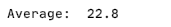
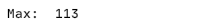
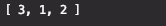

# JavaScript Challenges: Beginner to Master

54 JavaScript Challenges for Beginners To Become A Master


<hr>

# Introduction & Tutorial

If you are new to the challenge or don’t know how to start, [this](https://arnoldcode.com/wp-content/uploads/2021/04/Challenge-Template.zip) is a template you can download and take part in my coding challenge JavaScript – Internship to CEO.

<hr>

# Template
(Download the Challenge-Template)(https://arnoldcode.com/wp-content/uploads/2021/04/Challenge-Template.zip)

Just download the template, write your code into the challengeHere.js open the index.html in chrome or any other browser.

# Open Console to Inspect Your Code Output

- Chrome: Hit F12-Key to open console.
- Safari: Option + ⌘ + C.
- Firefox: Hit CTRL + SHIFT + K to open the Web console (COMMAND + SHIFT + K on Macs).
- Internet Explorer: Hit F12-Key to open console.

# Help & Detailed Solutions
Each commit has the solution inside.

To get help [contact me](mailto:info@arnoldcode.com) via e-mail.

<hr>


# Want To Learn Web Development Fast & Easy?

[HTML & CSS Starter Edition](https://arnoldcodeacademy.teachable.com/p/html-css-premium-gratis-starter-package)

Beginners Welcome
Where and How to Start
Perfect Resources
Save A Lot of Time
Create Your First Websites
Explained in Detail, But Simple

<hr>

# Challenge Overview

1. [Print numbers from 1 to 10 with a for-loop.](#challenge01)
2. [Print the odd numbers below than 99 with a for-loop.](#challenge02)
3. [Print a multiplication table with 6 with for-loop.](#challenge03)
4. [Print all the multiplication tables with numbers from 1 to 10 with a for-loop.](#challenge04)
5. [Calculate the sum of numbers from 1 to 24 with a for-loop.](#challenge05)
6. [Calculate 9! a for-loop.](#challenge06)
7. [Calculate the sum of odd numbers greater than 9 and less than 30 a for-loop.](#challenge07)
8. [Create a function that will convert from Celsius to Fahrenheit. Convert 0 degree Celsius.](#challenge08)
9. [Create a function that will convert from Fahrenheit to Celsius. Convert -38 degree Fahrenheit.](#challenge09)
10. [Calculate the sum of numbers in an array of numbers. The array: [1, 9, -19, 3, 5, 3, 7, 14, 91].](#challenge10)
11. [Calculate the average of the numbers in an array of numbers. The array: [2, 5, 17, 81, 9].](#challenge11)
12. [Create a function that receives an array of numbers and returns an array containing only the positive numbers. The array: [-65, 11, -5, 1, -19, 45, 19, 0, 1] ](#challenge12)
13. [Find the maximum number in an array of numbers.](#challenge13)
14. [Print the first 10 Fibonacci numbers without recursion. Fibonacci series: 0, 1, 1, 2, 3, 5, 8, 13, 21, 34, …](#challenge14)
15. [Create a function that will find the nth Fibonacci number using recursion. Fibonacci series: 0, 1, 1, 2, 3, 5, 8, 13, 21, 34, … . Use nth = 14](#challenge15)
16. [Create a function that will return a Boolean specifying if a number is prime. Test with 1,5,6,7,9,11,13 & 27.](#challenge16)
17. [Calculate the sum of digits of a positive integer number.The integer 1235321.](#challenge17)
18. [Print the first 99 prime numbers.](#challenge18)
19. [Create a function that will return in an array the first “nPrimes” prime numbers greater than a particular number “startAt”](#challenge19)
20. [Rotate an array to the left 1 position. E.g. [1, 2, 3, 4, 5] -> [ 2, 3, 4, 5, 1 ] | [1, 2, 4, 5] -> [ 2, 4, 5, 1 ].](#challenge20)
21. [Rotate an array to the right 1 position. E.g. [1, 2, 3] -> [ 3, 1, 2 ] | [1, 2, 4, 6, 3] -> [ 3, 1, 2, 4, 6 ].](#challenge21)
22. [Reverse a string. The string „JavaScript with ArnoldCode is the best!"](#challenge22)
23. ??? TBA
24. ??? TBA
25. ??? TBA 
26. ??? TBA 
27. ??? TBA 
28. ??? TBA 
29. ??? TBA 
30. ??? TBA 
31. ??? TBA 
32. ??? TBA 
33. ??? TBA 
34. ??? TBA 
35. ??? TBA 
36. ??? TBA 
37. ??? TBA 
38. ??? TBA 
39. ??? TBA 
40. ??? TBA 
41. ??? TBA 
42. ??? TBA 
43. ??? TBA 
44. ??? TBA 
45. ??? TBA 
46. ??? TBA 
47. ??? TBA 
48. ??? TBA 
49. ??? TBA 
50. ??? TBA 
51. ??? TBA 
52. ??? TBA 
53. ??? TBA 
54. ??? TBA 

# Challenge01 
## Print numbers from 1 to 10 with a for-loop.

<details>
    <summary>Spoiler "Solution-Explanation For Challenge 01"</summary>
  
  ```javascript
  // Solution #01
for (let i = 1; i <= 10; i++) {
    console.log(i);
}
```

// Get into the Community https://www.facebook.com/groups/webdevconquerors me on Facebook and don’t miss the latest Challenge!

/* EXPLANATION

  You need to print out ten numbers to the console prompt.

  A `for-loop` is the perfect tool for this job!

  You create a loop with a running index of `i` with the starting value of `1`.

  The loop will stop once `i` reaches the value of `11`, so when `i` equals `10`, the loop will execute the last time because you created the condition of    `i <= 10`.

  The running index will be increased by `1` every iteration. `i++` is the corresponding statement for that. It is the short form for `i = i+1`.

  Inside the loop you got your statement of `console.log(i);` which prints out, whatever is inside the brace, to the console window.

 */

// Get into the Community https://www.facebook.com/groups/webdevconquerors me on Facebook and don’t miss the latest Challenge!

</details>

# Challenge02 
## Print the odd numbers below than 99 with a for-loop.

<details>
  <summary>Spoiler "Solution-Explanation For Challenge 02"</summary>
  
  
```javascript
  // Solution #01
for (let i = 1; i <= 99; i += 2) {
    console.log(i);
}
```
Get into the Community https://www.facebook.com/groups/webdevconquerors me on Facebook and don’t miss the latest Challenge!

### EXPLANATION - Way #1

    To get the expected result, you start the running index i with the value of 1 and have in mind that in between every odd number comes an even number.

    Therefore, you increase your running index i by 2 every iteration with i += 2.

    You set the condition to <=99 because you only want to print out odd numbers below 99, that means the odd numbers between 1 to 97.

    Inside the loop you got your statement of console.log(i); which prints out, whatever is inside the brace, to the console window.

    In your case the wanted odd number.


// Solution #02

```javascript
for (let i = 1; i <= 99; i += 2) {
    console.log(i);
}
```
                       
Get into the Community https://www.facebook.com/groups/webdevconquerors me on Facebook and don’t miss the latest Challenge!

### EXPLANATION - Way #2

    When starting from 97, which is an odd number respectively, and iterate backwards, you almost got it.

    To get every odd number, remember yourself that in between every odd number comes an even number.

    Jumping over them by decreasing the running index `i` to get every odd number.

    You have to change the conditions for the `for-loop`.

    First `i` starts at `97`, then your condition has to be `i > 0`. Not `i >= 0`, otherwise you would print out the even number `0` (Yes `0` is an even number).

    The running index gets decreased by `2` after every iteration with `i -= 2`.

    Inside the loop you got your statement of `console.log(i);` which prints out, whatever is inside the brace, to the console window.

    In your case the wanted odd number.
</details>

# Challenge03
## Print a multiplication table with 6 with for-loop.

<details>
    <summary>Spoiler "Solution-Explanation For Challenge 03"</summary>
  
  ```javascript
for(let i = 1; i <= 10; i++)
{
    let row = "6 * " + i + " = " + 6 * i;
    console.log(row);
}
```

The console output of the solution
                      
Explanation
The row of six goes from 6 to 60. Therefore you will need a for-loop that iterates 10 times. You are a bit familiar with loops now (since you made challenge #01 and #02) and you know the rules of a for-loop.

The variable row is your printed statement every iteration. To get the multiplication table of six, you just multiply the base number of 6 with the next value of the iteration process. The row of six starts with 6*1, then 6*2, and then 6*3, and so on…

To print a decent table, you have to display the entire entry as a term. So 6 * 1 = 6 as code is "6 * " + i + " = " 6 * i . You need to have the quotation marks here, because you want a string as result. If you don’t use the quotation marks the “compiler” would then complain about the equal sign. Leaving out also the equal sign and the + sign in front of it would result in the following line:

let row = 6 *  + i + 6 * i;
Running the program then will print this:

Result of misused syntax

You would then have created a completely different term and therefore also a completely different output.

Be sure, that you know what you want to accomplish in order to use the right data types and statements.

</details>

# Challenge04
## Print all the multiplication tables with numbers from 1 to 10 with a for-loop.

<details>
    <summary>Spoiler "Solution-Explanation For Challenge 04"</summary>

  ```javascript
for(let i = 1; i <= 10; i++)
{
    printTable(i);
    console.log("");
}

function printTable(n)
{
    for(let i = 1; i <= 10; i++)
    {
        let row = n + " * " + i + " = " + n * i;
        console.log(row);
    }
}
```
A function is the best choice to accomplish this task.

If you aren’t familiar with functions. <b>No reason to worry.</b>

But first, if you accomplished this task with 10 different for loops - Your solution isn’t wrong.

It can be optimized to enter the next level of your skills: <b>10 for-loops aren’t a good thing.</b> 

Besides avoiding for loops for this solution [here are 10 principles that will level up your expertise](https://medium.com/next-level-source-code/do-you-follow-these-10-principles-for-good-programmers-1445727af447).

###Coming back to our solution - Code repetition is bad practice. 

<b>A rule of thumb:</b> If two parts of source code look the same in 50% of their lines, you've got doubled code.

Avoiding code repetition means having reusable tools.

A function suits that perfectly. A function provides input parameters. 
These are the settings for the function to operate with. 

Inside the body of the function, you have the reusable code pieces that operate slightly differently, 
depending on what you’ve put into the function as a parameter.

###Now really back to the solution: 
Having a `for`-loop to with a function call to `printTable()` inside will execute the function 
10 times since we configured the head of the `for`-loop to do it 10 times.

The function `printTable()` has an input parameter of `n`. The for-loop passes the variable `i` every iteration, 
respectively, the values of `1` to `10`.

You can now assume what the function must do. Right, the body is almost identical to the previous challenge, 
where you just print out one multiplication table. You changed the hard-coded `6` to an `n` and 
linked this variable to the input parameter of the function. That results in a function that 
prints out the multiplication table of the number we pass as a parameter.

Because the function does it for any number and once per call, we can just call it 
ten times with corresponding parameters and we got our solution right away!


The line of `console.log(""")`; just prints out an empty line as a divider for the multiplication tables.
</details>

# Challenge05
## Calculate the sum of numbers from 1 to 24 with a for-loop.

<details>
    <summary>Spoiler "Solution-Explanation For Challenge 05"</summary>

  ```javascript
let sum = 0;


for(let i = 1; i <= 24; i++)
{
    sum += i;
}

console.log(sum);
```
For the diversity, another challenge, but a simpler one! 

But that doesn’t mean you can switch off your brain 😉

You simply can’t put the accumulated value of sum inside the loop and print it to the console.

It would then end up with 24 print-out- statements.

You have to declare and initialize the variable of `sum` (and please use `let` here! Why?! [In-Depth Explanation - You will remember until your retirement why & where to use VAR, LET and CONST](https://javascript.plainenglish.io/javascript-const-vs-var-vs-let-a-comprehensive-guide-for-all-time-d6d836c8bbd7))
outside of the loop in order to print it out afterward.

If you decide to declare `sum` inside the loop, it would be initialized every iteration. But it must hold the actual accumulated value.

Furthermore, if you declared it inside the loop it would be out of our reach when we want to access it outside the loop. This is called a scope, declaring a variable inside a class/function/loop, makes it to a local variable which can’t be accessed from the outside (The article below addresses this in detail).

And this is the console output: 

</details>

# Challenge06
## Calculate 9! a for-loop.

<details>
    <summary>Spoiler "Solution-Explanation For Challenge 06"</summary>

```javascript
let factorial = 1;

for(let i = 1; i <= 9; i++)
{
    factorial *= i;
}

console.log(factorial);
```
To create the factorial of 9 you do almost the same steps as in challenge #05.

The difference lies in the loop body.

Last time you used this statement (`sum = sum+=i`) to gather the accumulated sum.

Knowing a bit about mathematics means you are aware of the fact that a factorial 
is nothing more than a chained multiplication.

So 9! is nothing more than `9 * 8 * 7 * 6 * 5 * 4 * 3 * 2 * 1 = 9!`. 

Together with the knowledge about `for`-loops you can draw your advantage out of this by using the running index
of `i` to create the factorial.

To get your desired result, you iterate exact 9 times!


</details>

# Challenge07
## Calculate the sum of odd numbers greater than 9 and less than 30 a for-loop.

<details>
    <summary>Spoiler "Solution-Explanation For Challenge 07"</summary>

```javascript
let sum = 0;

for(let i = 11; i <= 30; i += 2)
{
    sum += i;
}

console.log(sum);
```
To accomplish your task, you should remember [Challenge #02](#challenge02). 
Because back then, the task was to print out every odd number below 99. 
That means you created a `for` loop with an increment of `2`. 
After each iteration to get only odd numbers when starting with an odd number. 
In your case with `11`.

Remembering [Challenge #05](#challenge05)? This one makes you also happy again. 
There you had the task to create the `sum` of the numbers from `1` to `24`.
The same concept applies to this task. 
You add up every odd number (`n`) `n > 9` and `n < 30` to a `sum`.

After the loop has finished, you print it to the console:


Accumulated value printed out to the console (Sum of all odd numbers >9 & <30)

</details>

# Challenge08
## Create a function that will convert from Celsius to Fahrenheit. Convert 0 degree Celsius.

<details>
    <summary>Spoiler "Solution-Explanation For Challenge 08"</summary>

```javascript
function convertCelsiusToFahrenheit(number)
{
    return number * 1.8 + 32;
}

let degreeFahrenheit = convertCelsiusToFahrenheit(0);
console.log(degreeFahrenheit);
```
### How to convert Celsius to Fahrenheit

The temperature T in degrees Fahrenheit (°F) is equal to the temperature T in degrees Celsius (°C) times 9/5 plus 32:


or with decimals


### Example Conversion of 20 degrees Celsius to ?? degrees Fahrenheit:


### Accomplishing The Task

To accomplish your task, you need to return a number calculated with `1.8` and add `32`.

This is done with the parameter inside `convertCelsiusToFahrenheit()`.

The last step is to return the converted number and printing it out.

The console will print out `32` when you put in the number `0`.


</details>

# Challenge09
## Create a function that will convert from Fahrenheit to Celsius. Convert -38 degree Fahrenheit.

<details>
    <summary>Spoiler "Solution-Explanation For Challenge 09"</summary>

```javascript
function convertCelsiusToFahrenheit(number)
{
    return number * 1.8 + 32;
}

let degreeFahrenheit = convertCelsiusToFahrenheit(0);
console.log(degreeFahrenheit);
```
### How to convert Celsius to Fahrenheit

The temperature T in degrees Fahrenheit (°F) is equal to the temperature T in degrees Celsius (°C) times 9/5 plus 32:


or 


### Example Conversion of 20 degrees Celsius to ?? degrees Fahrenheit:


### Accomplishing The Task

To accomplish your task, you need to reverse the conversion of degrees to Fahrenheit. 
This means we first subtract 32 and then divide by 1.8.

This is done in the `convertFahrenheitToCelsius`-function.

Just call the function, pass the number as argument and print the returned value out. <b>And you are done!</b>

The console prints out `-38.888888888888886` when we put in the number -38.

Because this is the point where Celsius and Fahrenheit have the same amount.

</details>

# Challenge10
## Calculate the sum of numbers in an array of numbers. The array: [1, 9, -19, 3, 5, 3, 7, 14, 91].

<details>
    <summary>Spoiler "Solution-Explanation For Challenge 10"</summary>

```javascript
function summarizeArray(array) {
    let sum = 0;

    for (let i = 0; i < array.length; i++) {
        sum += array[i];
    }

    return sum;
}

let array = [1, 9, -19, 3, 5, 3, 7, 14, 91]
let sum = summarizeArray(array);
console.log(sum);
```

To accomplish our task, you need to iterate over the array and build the sum out of each element.

Since you aren’t so experienced right now, you should not use the `reduce()` method. 
Instead, write basic operations like above using a `for` loop.

After the loop has finished, you print the sum to the console:\


</details>

# Challenge11
## Calculate the average of the numbers in an array of numbers. The array: [2, 5, 17, 81, 9].

<details>
    <summary>Spoiler "Solution-Explanation For Challenge 11"</summary>

```javascript
function averageArray(array) {
    let length = array.length;
    let sum = 0;

    for (let i = 0; i < length; i++) {
        sum += array[i];
    }

    return sum / length;
}

let array = [2, 5, 17, 81, 9];
let average = averageArray(array);

console.log("Average: ", average);
```

**How to calculate an average**\
A calculated “central” value of a set of numbers.

To calculate it: add up all the numbers, then divide by the total amount of numbers.

Example: what is the average of 2, 7 and 9?\
Add all numbers: 2 + 7 + 9 = 18
Divide by numbers count (2, 7, 9 are 3 numbers) \
18 ÷ 3 = 6 

So the average is 6. (Also called the Arithmetic Mean.)

**Accomplishing your Goal**

To accomplish your task, you create a function called `averageArray()'\
that accepts a parameter. This will be your array you hand to the function.

You need to get the length of the array for a `for`-loop.\
Creating a sum and then dividing by the length gets the average.

Just return the number and print it to the console, and you are done!



</details>

# Challenge12
## Create a function that receives an array of numbers and returns an array containing only the positive numbers. The array: [-65, 11, -5, 1, -19, 45, 19, 0, 1].

<details>
    <summary>Spoiler "Solution-Explanation For Challenge 12"</summary>

```javascript
function getPositives(array) {
    let tempArray = [];

    for (let i = 0; i < array.length; i++) {
        let element = array[i];

        if (element >= 0) {
            tempArray.push(element);
        }
    }

    return tempArray;
}

let array = [-65, 11, -5, 1, -19, 45, 19, 0, 1];
let positives = getPositives(array);

console.log(positives);
```

To accomplish your task, you need to create a function called that only returns positive numbers.\
In this case I called it `getPositives()` and passed in the array.

Inside the body, you need to create a new array (`tempArray`).\
This one will keep only the positives numbers.

The next step is to loop over the array you passed to the function `array`.
Check for each element if it is positive by checking it against greater than equal 0 ( `>=0`).

If `TRUE`, add it to the newly created `tempArray`.
If `FALSE`, don't add it to `tempArray`. 

Once, you are done iterating, checking and adding, just return the `tempArray` and print it to the console.\
Done!


</details>

# Challenge13
## Create a function that receives an array of numbers and returns an array containing only the positive numbers. The array: [-65, 11, -5, 1, -19, 45, 19, 0, 1].

<details>
    <summary>Spoiler "Solution-Explanation For Challenge 13"</summary>

```javascript
function findMax(array) {
    let max = array[0];

    for (let i = 0; i < array.length; i++) {
        if (array[i] > max) {
            max = array[i];
        }
    }

    return max;
}

let array = [-21, 113, -34, 1, -9, 5, 99, 1, 0];
let max = findMax(array);
console.log("Max: ", max);
```

To accomplish your task, you create a function called `findMax()` and pass in your array.

Inside the body, you need to create a variable referencing your found maximum value.

You set the variable `max` to the first element of you array. 

Since this it the first maximum existing. You didn’t check any other so far.

The next step is to loop over the array and check if the element you are currently looking at is greater than your current `max` value.

If so, replace it to the newly found maximum element of array.

Once, you are done iterating, comparing, and adding, just return the found maximum and print it to the consol.

You are done!



</details>

# Challenge14
## Print the first 10 Fibonacci numbers without recursion. Fibonacci series: 0, 1, 1, 2, 3, 5, 8, 13, 21, 34, …

<details>
    <summary>Spoiler "Solution-Explanation For Challenge 14"</summary>

```javascript
let fibbonacci0 = 0;
console.log(fibbonacci0);

let fibonacci1 = 1;
console.log(fibonacci1);

for(let i = 2; i < 10; i++)
{
    let fibonacci = fibonacci1 + fibbonacci0;
    console.log(fibonacci);

    fibbonacci0 = fibonacci1;
    fibonacci1 = fibonacci;
}
```

You start with the creation of the `for` loop. 

Make sure to define the loop runs from `2` to `10`  in order to get the first 10 numbers. 

Start with the `0` followed by `1` and you only need 8 more numbers to complete.

Any number `n` of the Fibonacci series is created by adding up the number `n-1` with the number `n-2`.

To get the third number, we need to have number `n-1` and `n-2`. 

Reaching `n = 3`, means the number will be `2` and `1` of the series.

The equation is therefore: `n = n – 1 + n – 2;`

Which results into: `2 = 1 + 0;`. The 3rd number of the Fibonacci series.

Then you need to switch the `n – 1` and `n – 2` to the newly created ones to go further in our Fibonacci series. 

E voilá, do it as long as you want to get all numbers for the Fibonacci series.

The complete outcome of the console:


</details>

# Challenge15
## Create a function that will find the nth Fibonacci number using recursion. Fibonacci series: 0, 1, 1, 2, 3, 5, 8, 13, 21, 34, … . Use nth = 14

<details>
    <summary>Spoiler "Solution-Explanation For Challenge 15"</summary>

```javascript
function findFibonacci(number)
{
    if (number === 0)
        return 0;

    if (number === 1)
        return 1;

    return findFibonacci(number - 1) + findFibonacci(number - 2);
}

let fibonacciSeries = findFibonacci(14);

console.log(fibonacciSeries);
```

The Fibonacci numbers are the numbers in the following integer sequence.

`0, 1, 1, 2, 3, 5, 8, 13, 21, 34, 55, 89, 144, ……`

In mathematical terms, the sequence Fn of Fibonacci numbers is defined by the recurrence relation:


</details>

# Challenge16
## Create a function that will return a Boolean specifying if a number is prime. Test with 1,5,6,7,9,11,13 & 27.

<details>
    <summary>Spoiler "Solution-Explanation For Challenge 16"</summary>

```javascript
function isPrime(number)
{
    if (number < 2)
        return false;

    if (number == 2)
        return true;

    let maxDiv = Math.sqrt(number);

    for(let i = 2; i <= maxDiv; i++)
    {
        if (number % i == 0)
        {
            return false;
        }
    }

    return true;
}
```
## What is a prime number in maths?

Prime numbers are special numbers, greater than 1, that have exactly two factors, themselves and 1. 

19 is a prime number. It can only be divided by 1 and 19. 

9 is not a prime number.

## Solution

In your solution, you first check if the passed number is below 2. 

Then you already checked against any number below 2 being no prime number.

If the number is equal to 2, then it is a prime number and you can return `true` already.

If any number passed both checks and you are still inside your function, then you'll need find the maximum divisor by getting the square root of our passed number.

With a for loop, you check if the number is remainderless dividable by the iterator of i. 

If the remainder is 0, then you definitely have another valid calculation instead of only being able to divide a number with 1 and itself to be a prime number. 

Therefore, you are returning `false`.

Testifying the given numbers results into this printout.


</details>

# Challenge17
## Calculate the sum of digits of a positive integer number. The integer 1235321.

<details>
    <summary>Spoiler "Solution-Explanation For Challenge 17"</summary>

```javascript
function sumDigits(number)
{
    let string = number.toString();
    let sum = 0;

    for(let char of string)
    {
        let digit = parseInt(char);
        sum += digit;
    }

    return sum;
}

let sum = sumDigits(1235321);

console.log("Sum: ", sum);
```

The solution is pretty straightforward. 

You need to separate the digits to loop over them and add them to a sum.

You can do it by a conversion to a string because this is nothing more than a char array under the hood.

You can take advantage of this knowledge by iterating over the array with a for-of-loop.

While looping you add up the sum and finally returning the sum to the caller.

This is the printout after the sum was created:


</details>

# Challenge18
## Print the first 99 prime numbers.

<details>
    <summary>Spoiler "Solution-Explanation For Challenge 18"</summary>

```javascript
printPrimes(99);

// Function prints the first nPrimes numbers
function printPrimes(nPrimes)
{
    let n = 0;
    let i = 2;

    while(n < nPrimes)
    {
        if (isPrime(i))
        {
            console.log(n, " --> ", i);
            n++;
        }

        i++;
    }
}


// Returns true if a number is prime
function isPrime(number)
{
    if (number < 2)
        return false;

    if (number == 2)
        return true;

    let maxDiv = Math.sqrt(number);

    for(let i = 2; i <= maxDiv; i++)
    {
        if (number % i == 0)
        {
            return false;
        }
    }

    return true;
}
```

The function `printPrimes(nPrimes)` is your looping function that will print out the number of primes you pass in.

We stick to `99` for this challenge.

The next step is to set `n` to `0`, because you want to start with the 0th prime number and set `i` to `2`,
because we know the first prime number must be `2`.

Then you loop over the condition of `n < nPrimes` and check if the value of `i` is a prime number by actually calling your second function: `isPrime(number)`.

This function is all about checking if the number is below `2`; no prime number. Then if it is equal to `2`; a prime number. 

For every other case, you apply the commonly known rules for prime numbers. Being divideable only by itself or `1`.

The for loop checks if you have a `maxdivisor` that results in a valid integer division with the result of `0`.

If so, it isn’t a prime number; referring back to the commonly known rules for prime numbers.

If the loop does not return `false` and run through successfully, the function returns `true`, and the while loop of `printPrimes` continues.

Below is the printout for the first `18` numbers. 

The list goes on until `99`. The output means the 0th prime number is `2`, then the 1st prime number is `3`, and so on…

)
</details>

# Challenge19
## Create a function that will return in an array the first “nPrimes” prime numbers greater than a particular number “startAt”.

<details>
    <summary>Spoiler "Solution-Explanation For Challenge 19"</summary>

```javascript
console.log(getPrimes(10, 100));


function getPrimes(nPrimes, startAt)
{
    let array = [];

    let i = startAt;

    while(array.length < nPrimes)
    {
        if (isPrime(i))
        {
            array.push(i);
        }

        i++;
    }

    return array;
}

// Returns true if a number is prime
function isPrime(number)
{
    if (number < 2)
        return false;

    if (number == 2)
        return true;

    let maxDiv = Math.sqrt(number);

    for(let i = 2; i <= maxDiv; i++)
    {
        if (number % i == 0)
        {
            return false;
        }
    }

    return true;
}
```

The function `getPrimes` has to accept two parameters. 
1. `nPrimes` which decides the number of prime numbers you want to be printed
2. `startAt` which decides where you start to calculate the prime numbers

You create an empty array and set your runningIndex `i` equal to the `startAt` variable.

A while loop makes a continuous call to the `isPrime` function and passes in the number you want to check. 

This is being done as long as your array is below the `nPrimes` variable.

Once you have the predestined number of primes, you will skip the while loop and return the array with prime numbers.

I have already explained the `isPrime` function in [Challenge #18](#challenge18).

If you call this function with `console.log(getPrimes(10, 100));` then the following will be the output.


</details>

# Challenge20
## Rotate an array to the left 1 position. E.g. [1, 2, 3, 4, 5] -> [ 2, 3, 4, 5, 1 ] | [1, 2, 4, 5] -> [ 2, 4, 5, 1 ].

<details>
    <summary>Spoiler "Solution-Explanation For Challenge 20"</summary>

```javascript
let array = [1, 2, 3, 4, 5];
rotateLeft(array);
console.log(array);

function rotateLeft(array)
{
    let first = array.shift();
    array.push(first);
}
```

You can achieve this challenge’s goal quite easily by using the `shift()` and the `push()` method for arrays. 

The `shift()` method removes the first element of an array and returns it. 

If you store it now into a temporarily variable (in this case `first`) then you can use the `push()` method to push it as the last element of an array.

If you want to dig deeper into `shift()` and `push()` and JavaScript + Web Development take my [JavaScript Course](https://arnoldcodeacademy.teachable.com/p/javascript-beginner-course), 
where I introduce you also to all kinds of array methods (there are plenty of them and they are very useful to achieve massive results in a short amount of code and time).

<b>[A discount awaits you! Just subscribe to my newsletter.](https://arnoldcodeacademy.ck.page/26webdevcheatsheets)

The output for the code above is:


</details>


# Challenge21
## Rotate an array to the right 1 position. E.g. [1, 2, 3] -> [ 3, 1, 2 ] | [1, 2, 4, 6, 3] -> [ 3, 1, 2, 4, 6 ].

<details>
    <summary>Spoiler "Solution-Explanation For Challenge 21"</summary>

```javascript
let array = [1, 2, 3];

rotateRight(array);

console.log(array);

function rotateRight(array)
{
    let last = array.pop();
    array.unshift(last);
}
```

You can achieve the challenge’s goal quite easily by using the opposites of `shift()` and the `push()` method for arrays.

This time you have to use the `pop()` method which removes the last element of an array and returns it.

If you store it now into a variable (in this case `last`) then you can use the `unshift()` method to push it as the 
first element of an array.


If you want to dig deeper into `shift()` and `push()` and JavaScript + Web Development take my [JavaScript Course](https://arnoldcodeacademy.teachable.com/p/javascript-beginner-course),
where I introduce you also to all kinds of array methods (there are plenty of them and they are very useful to achieve massive results in a short amount of code and time).

<b>[A discount awaits you! Just subscribe to my newsletter.](https://arnoldcodeacademy.ck.page/26webdevcheatsheets)

The output for the code above is:



</details>


# Challenge22 + Pro Solution 😉
## Reverse a string. The string „JavaScript with ArnoldCode is the best!“

<details>
    <summary>Spoiler "Solution-Explanation For Challenge 22"</summary>

```javascript
// Solution with for - loops
let reversedString = reverseString('JavaScript with ArnoldCode is the best!');
console.log(reversedString);

function reverseString(string)
{
    let string2 = "";

    for(let i = string.length - 1; i >= 0; i--)
    {
        string2 += string[i];
    }

    return string2;
}
````
## Solution for pro developers!
```typescript
reversedString = reverseString('JavaScript with ArnoldCode is the best!');
console.log(reversedString);

function reverseString(string)
{
    return string.split('').reverse().join('')
}
```

## Explanation For-Loops

The function `reverseString` creates an empty string `string2` where the reversed string will be stored to.

A simple `for` loop covers the tasks of reversing your string.

It does it by decrementing the running index of `i` from the `string.length` towards `0` and pushes beginning from the last element of the passed `string` until the first into `string2`.

*This is possible due to the fact that a string is in fact an arrays of characters.*

After the for loop, the function just returns your newly reversed `string` of `string2`.


If you want to dig deeper into strings, arrays and  their methods check out the pro solution.

## Explanation Pro Solution

You can achieve the challenge’s goal quite easily by using 3 advanced methods for strings and arrays:
- [split](https://developer.mozilla.org/en-US/docs/Web/JavaScript/Reference/Global_Objects/String/split) - Splits up a string by a given character template (in this case `''`; any char)
- [reverse](https://developer.mozilla.org/en-US/docs/Web/JavaScript/Reference/Global_Objects/Array/reverse) - Reverses an order of elements inside an array
- [join](https://developer.mozilla.org/en-US/docs/Web/JavaScript/Reference/Global_Objects/Array/join) - Combines all elements into a single string

So the order of actions for success is:
1. Splitting the string into characters
2. Reversing the order of characters
3. Combining all reversed characters into a single string

If you want to become a [Web Developer you want to take my examples](https://arnoldcodeacademy.teachable.com/p/javascript-beginner-course), explanations and story telling into the 3rd dimensions and save time & effort 😉

[A discount and 26 Cheatsheets await you! Just subscribe to my newsletter.](https://arnoldcodeacademy.ck.page/26webdevcheatsheets)


</details>
