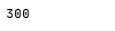

# javascript-challenges-internship-to-ceo

54 JavaScript Challenges for Beginners To Become A Master


# Introduction & Tutorial

If you are new to the challenge or don’t know how to start, [this](https://arnoldcode.com/wp-content/uploads/2021/04/Challenge-Template.zip) is a template you can download and take part in my coding challenge JavaScript – Internship to CEO.

# Template
(Download the Challenge-Template)(https://arnoldcode.com/wp-content/uploads/2021/04/Challenge-Template.zip)

Just download the template, write your code into the challengeHere.js open the index.html in chrome or any other browser.

# Open Console to Inspect Your Codde Output

- Chrome: Hit F12-Key to open console.
- Safari: Option + ⌘ + C.
- Firefox: Hit CTRL + SHIFT + K to open the Web console (COMMAND + SHIFT + K on Macs).
- Internet Explorer: Hit F12-Key to open console.

# Help & Detailed Solutions
Each commit has the solution inside.

To get [help](https://www.facebook.com/groups/webdevconquerors) or see the solution in detail and discussed [join the group](https://www.facebook.com/groups/webdevconquerors).


# Challenge Overview

1. [Print numbers from 1 to 10 with a for-loop.](#challenge01)
2. [Print the odd numbers below than 99 with a for-loop.](#challenge02)
3. [Print a multiplication table with 6 with for-loop.](#challenge03)
4. [Print all the multiplication tables with numbers from 1 to 10 with a for-loop.](#challenge04)
5. [Calculate the sum of numbers from 1 to 24 with a for-loop.](#challenge05)
6. ??? TBA
7. ??? TBA
8. ??? TBA
9. ??? TBA
10. ??? TBA
11. ??? TBA
12. ??? TBA
13. ??? TBA
14. ??? TBA
15. ??? TBA
16. ??? TBA
17. ??? TBA
18. ??? TBA
19. ??? TBA
20. ??? TBA
21. ??? TBA
22. ??? TBA
23. ??? TBA
24. ??? TBA
25. ??? TBA
26. ??? TBA
27. ??? TBA
28. ??? TBA
29. ??? TBA
30. ??? TBA
31. ??? TBA
32. ??? TBA
33. ??? TBA
34. ??? TBA
35. ??? TBA
36. ??? TBA
37. ??? TBA
38. ??? TBA
39. ??? TBA
40. ??? TBA
41. ??? TBA
42. ??? TBA
43. ??? TBA
44. ??? TBA
45. ??? TBA
46. ??? TBA
47. ??? TBA
48. ??? TBA
49. ??? TBA
50. ??? TBA
51. ??? TBA
52. ??? TBA
53. ??? TBA
54. ??? TBA

# Challenge01 
## Print numbers from 1 to 10 with a for-loop.

<details>
    <summary>Spoiler "Solution-Explanation For Challenge 01"</summary>
  
  ```javascript
  // Solution #01
for (let i = 1; i <= 10; i++) {
    console.log(i);
}
```

// Get into the Community https://www.facebook.com/groups/webdevconquerors me on Facebook and don’t miss the latest Challenge!

/* EXPLANATION

  You need to print out ten numbers to the console prompt.

  A `for-loop` is the perfect tool for this job!

  You create a loop with a running index of `i` with the starting value of `1`.

  The loop will stop once `i` reaches the value of `11`, so when `i` equals `10`, the loop will execute the last time because you created the condition of    `i <= 10`.

  The running index will be increased by `1` every iteration. `i++` is the corresponding statement for that. It is the short form for `i = i+1`.

  Inside the loop you got your statement of `console.log(i);` which prints out, whatever is inside the brace, to the console window.

 */

// Get into the Community https://www.facebook.com/groups/webdevconquerors me on Facebook and don’t miss the latest Challenge!

</details>

# Challenge02 
## Print the odd numbers below than 99 with a for-loop.

<details>
  <summary>Spoiler "Solution-Explanation For Challenge 02"</summary>
  
  
```javascript
  // Solution #01
for (let i = 1; i <= 99; i += 2) {
    console.log(i);
}
```
Get into the Community https://www.facebook.com/groups/webdevconquerors me on Facebook and don’t miss the latest Challenge!

### EXPLANATION - Way #1

    To get the expected result, you start the running index i with the value of 1 and have in mind that in between every odd number comes an even number.

    Therefore, you increase your running index i by 2 every iteration with i += 2.

    You set the condition to <=99 because you only want to print out odd numbers below 99, that means the odd numbers between 1 to 97.

    Inside the loop you got your statement of console.log(i); which prints out, whatever is inside the brace, to the console window.

    In your case the wanted odd number.


// Solution #02

```javascript
for (let i = 1; i <= 99; i += 2) {
    console.log(i);
}
```
                       
Get into the Community https://www.facebook.com/groups/webdevconquerors me on Facebook and don’t miss the latest Challenge!

### EXPLANATION - Way #2

    When starting from 97, which is an odd number respectively, and iterate backwards, you almost got it.

    To get every odd number, remember yourself that in between every odd number comes an even number.

    Jumping over them by decreasing the running index `i` to get every odd number.

    You have to change the conditions for the `for-loop`.

    First `i` starts at `97`, then your condition has to be `i > 0`. Not `i >= 0`, otherwise you would print out the even number `0` (Yes `0` is an even number).

    The running index gets decreased by `2` after every iteration with `i -= 2`.

    Inside the loop you got your statement of `console.log(i);` which prints out, whatever is inside the brace, to the console window.

    In your case the wanted odd number.
</details>

# Challenge03
## Print a multiplication table with 6 with for-loop.

<details>
    <summary>Spoiler "Solution-Explanation For Challenge 03"</summary>
  
  ```javascript
for(let i = 1; i <= 10; i++)
{
    let row = "6 * " + i + " = " + 6 * i;
    console.log(row);
}
```

The console output of the solution
                      
Explanation
The row of six goes from 6 to 60. Therefore you will need a for-loop that iterates 10 times. You are a bit familiar with loops now (since you made challenge #01 and #02) and you know the rules of a for-loop.

The variable row is your printed statement every iteration. To get the multiplication table of six, you just multiply the base number of 6 with the next value of the iteration process. The row of six starts with 6*1, then 6*2, and then 6*3, and so on…

To print a decent table, you have to display the entire entry as a term. So 6 * 1 = 6 as code is "6 * " + i + " = " 6 * i . You need to have the quotation marks here, because you want a string as result. If you don’t use the quotation marks the “compiler” would then complain about the equal sign. Leaving out also the equal sign and the + sign in front of it would result in the following line:

let row = 6 *  + i + 6 * i;
Running the program then will print this:

Result of misused syntax

You would then have created a completely different term and therefore also a completely different output.

Be sure, that you know what you want to accomplish in order to use the right data types and statements.

</details>

# Challenge04
## Print all the multiplication tables with numbers from 1 to 10 with a for-loop.

<details>
    <summary>Spoiler "Solution-Explanation For Challenge 04"</summary>

  ```javascript
for(let i = 1; i <= 10; i++)
{
    printTable(i);
    console.log("");
}

function printTable(n)
{
    for(let i = 1; i <= 10; i++)
    {
        let row = n + " * " + i + " = " + n * i;
        console.log(row);
    }
}
```
A function is the best choice to accomplish this task.

If you aren’t familiar with functions. <b>No reason to worry.</b>

But first, if you accomplished this task with 10 different for loops - Your solution isn’t wrong.

It can be optimized to enter the next level of your skills: <b>10 for-loops aren’t a good thing.</b> 

Besides avoiding for loops for this solution [here are 10 principles that will level up your expertise](https://medium.com/next-level-source-code/do-you-follow-these-10-principles-for-good-programmers-1445727af447).

###Coming back to our solution - Code repetition is bad practice. 

<b>A rule of thumb:</b> If two parts of source code look the same in 50% of their lines, you've got doubled code.

Avoiding code repetition means having reusable tools.

A function suits that perfectly. A function provides input parameters. 
These are the settings for the function to operate with. 

Inside the body of the function, you have the reusable code pieces that operate slightly differently, 
depending on what you’ve put into the function as a parameter.

###Now really back to the solution: 
Having a `for`-loop to with a function call to `printTable()` inside will execute the function 
10 times since we configured the head of the `for`-loop to do it 10 times.

The function `printTable()` has an input parameter of `n`. The for-loop passes the variable `i` every iteration, 
respectively, the values of `1` to `10`.

You can now assume what the function must do. Right, the body is almost identical to the previous challenge, 
where you just print out one multiplication table. You changed the hard-coded `6` to an `n` and 
linked this variable to the input parameter of the function. That results in a function that 
prints out the multiplication table of the number we pass as a parameter.

Because the function does it for any number and once per call, we can just call it 
ten times with corresponding parameters and we got our solution right away!


The line of `console.log(""")`; just prints out an empty line as a divider for the multiplication tables.
</details>

# Challenge05
## Calculate the sum of numbers from 1 to 24 with a for-loop .

<details>
    <summary>Spoiler "Solution-Explanation For Challenge 05"</summary>

  ```javascript
let sum = 0;


for(let i = 1; i <= 24; i++)
{
    sum += i;
}

console.log(sum);
```
For the diversity, another challenge, but a simpler one! 

But that doesn’t mean you can switch off your brain 😉

You simply can’t put the accumulated value of sum inside the loop and print it to the console.

It would then end up with 24 print-out- statements.

You have to declare and initialize the variable of `sum` (and please use `let` here! Why?! [In-Depth Explanation - You will remember until your retirement why & where to use VAR, LET and CONST](https://javascript.plainenglish.io/javascript-const-vs-var-vs-let-a-comprehensive-guide-for-all-time-d6d836c8bbd7))
outside of the loop in order to print it out afterward.

If you decide to declare `sum` inside the loop, it would be initialized every iteration. But it must hold the actual accumulated value.

Furthermore, if you declared it inside the loop it would be out of our reach when we want to access it outside the loop. This is called a scope, declaring a variable inside a class/function/loop, makes it to a local variable which can’t be accessed from the outside (The article below addresses this in detail).

And this is the console output: 

</details>
